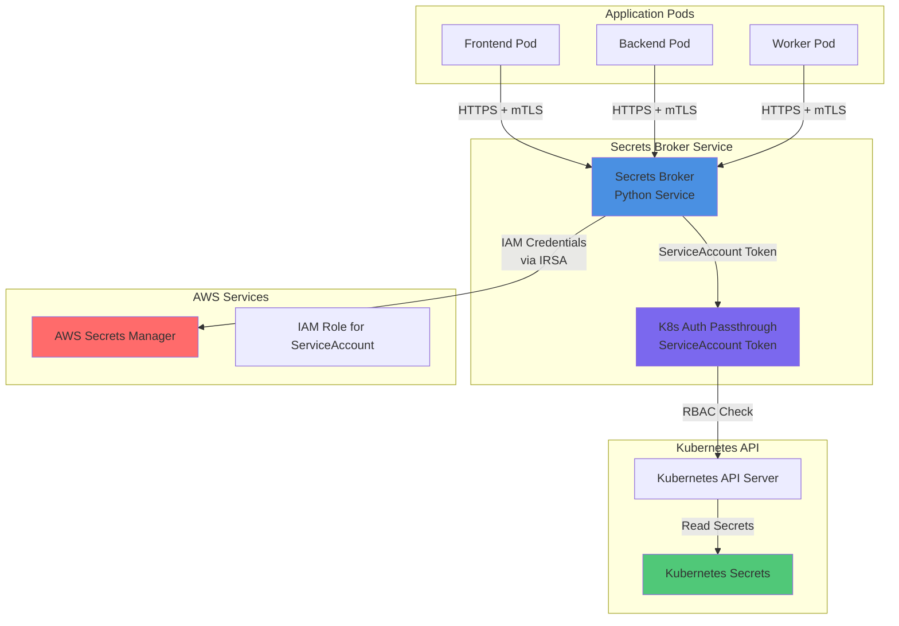
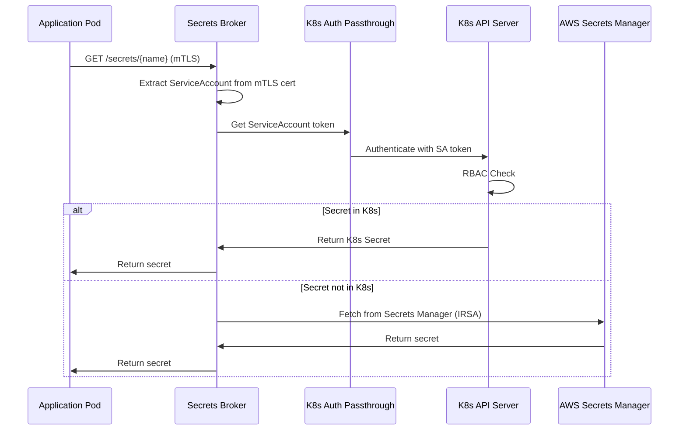
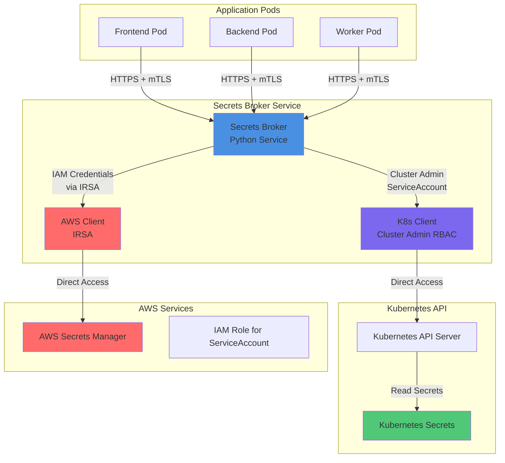
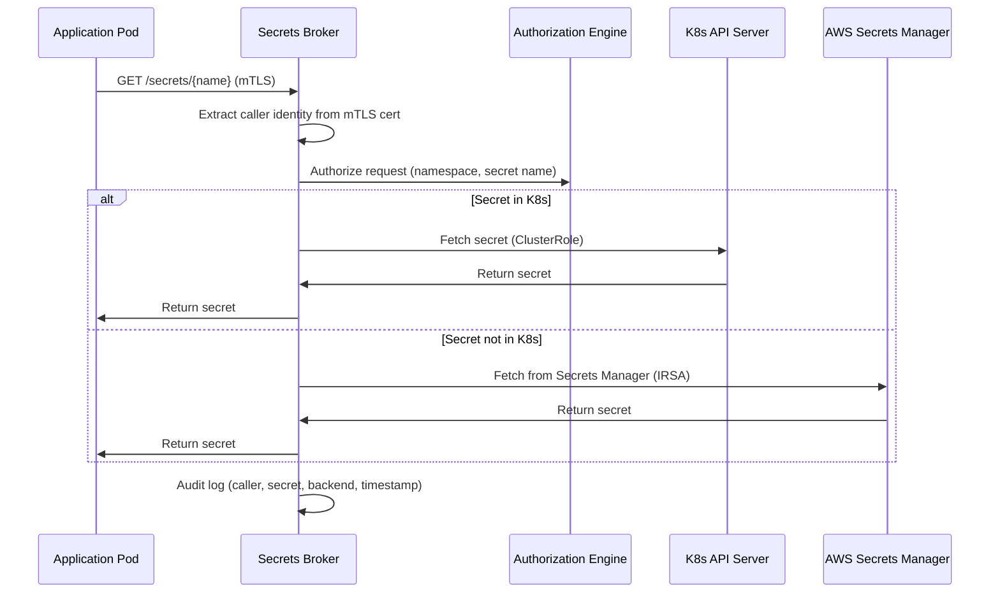
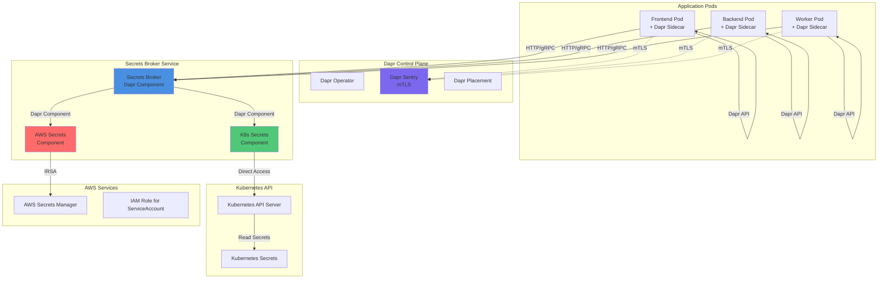
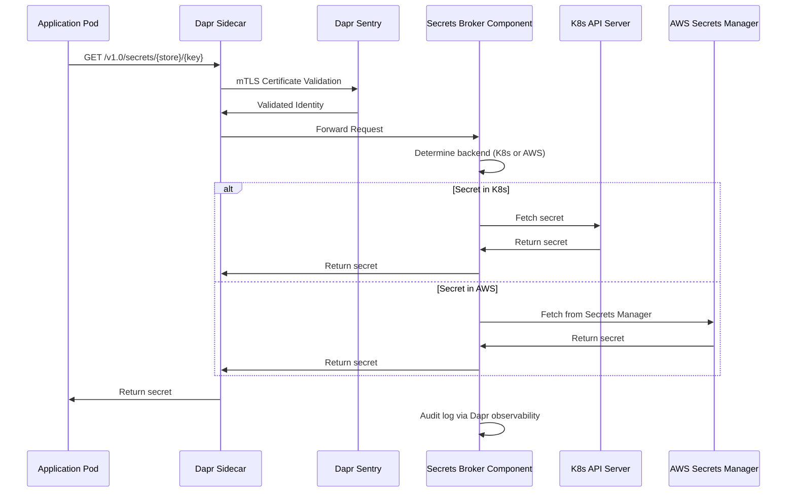
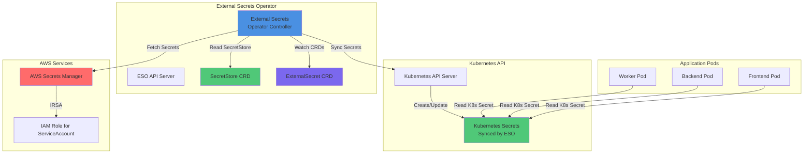
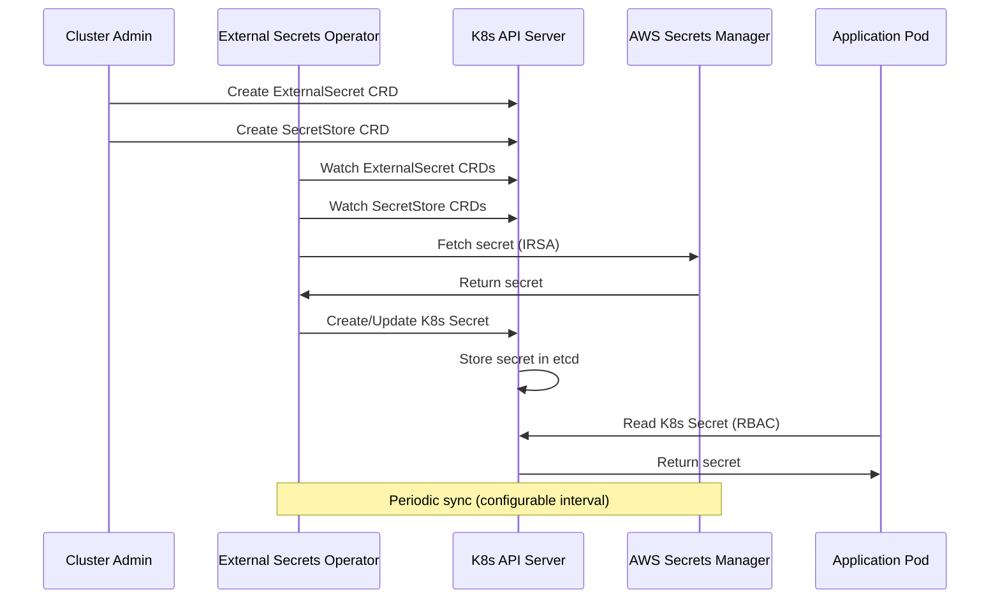
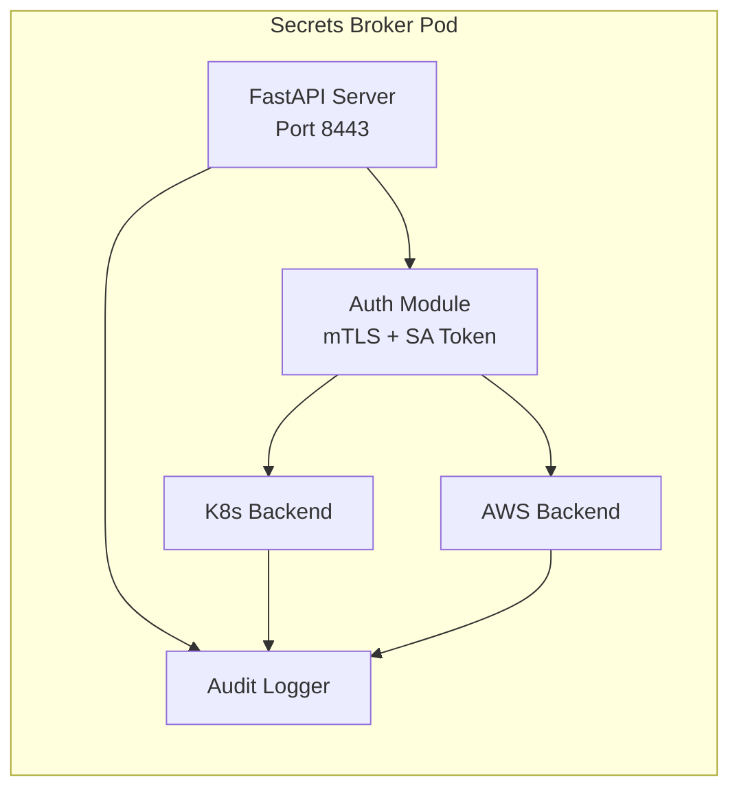

# ADR-001: Kubernetes Secrets Broker Service Architecture

## Status
**Proposed** | Date: 2024-12-19 | Authors: Platform Engineering Team

## Context

In air-gapped Kubernetes deployments, applications require secure **read-only** access to secrets stored across multiple backends:
- Kubernetes Secrets (native K8s resources)
- AWS Secrets Manager (external cloud service)

**Note**: Applications will only fetch/read secrets through this service. Secret creation and updates are managed separately by cluster administrators or CI/CD pipelines.

Current challenges:
1. **Direct Secret Access Limitations**: Some applications cannot directly read Kubernetes Secrets due to RBAC constraints, security policies, or architectural patterns
2. **Multi-Backend Complexity**: Secrets exist in both Kubernetes Secrets and AWS Secrets Manager, requiring different access mechanisms
3. **Dynamic Secret Lifecycle**: Secrets are created at various times (before, during, or after application deployment), requiring just-in-time fetching capabilities
4. **Security Requirements**: Need for mTLS, auditability, and secure communication patterns
5. **Operational Overhead**: Mounting secrets as volumes/files creates coupling and reduces flexibility

## Decision Drivers

1. **Security**: mTLS support, auditability, least-privilege access
2. **Flexibility**: Support multiple secret backends (K8s Secrets, AWS Secrets Manager)
3. **Performance**: Lightweight service with minimal resource footprint
4. **Dynamic Access**: Just-in-time secret fetching without pre-mounting
5. **Air-Gapped Compatibility**: Must work in isolated environments
6. **Maintainability**: Python3-based service with comprehensive logging
7. **Backend Priority**: Check Kubernetes Secrets first, then fallback to configured backends

## Considered Options

### Option 1: Secrets Broker Service with AWS Secrets Manager + Kubernetes Secrets Support (Centralized Proxy with K8s Auth Passthrough)

#### Architecture



#### Description

A centralized Python service that acts as a proxy, leveraging Kubernetes ServiceAccount tokens for authentication passthrough. Applications authenticate to the broker using mTLS, and the broker uses the caller's ServiceAccount context to access Kubernetes Secrets, maintaining RBAC enforcement.

#### Flow Diagram



#### Pros
- ✅ Maintains Kubernetes RBAC enforcement through ServiceAccount passthrough
- ✅ Single point of access control and auditability
- ✅ Supports both K8s Secrets and AWS Secrets Manager
- ✅ Lightweight Python service
- ✅ mTLS support for secure communication
- ✅ Read-only access model simplifies security and operations

#### Cons
- ❌ Requires ServiceAccount token management
- ❌ Additional network hop for secret access
- ❌ ServiceAccount token rotation handling needed
- ❌ No caching in MVP (deferred to long-term)

#### Implementation Notes
- Service extracts ServiceAccount identity from mTLS client certificate
- Uses Kubernetes client library with ServiceAccount token
- Read-only operations: GET requests only, no write/update/delete endpoints
- Audit logs include: caller identity, secret name, backend source, timestamp

---

### Option 2: Secrets Broker Service with AWS Secrets Manager + Kubernetes Secrets Support (Direct Access)

#### Architecture



#### Description

A centralized Python service with elevated Kubernetes permissions (ClusterRole) that directly accesses both Kubernetes Secrets and AWS Secrets Manager. Applications authenticate via mTLS, and the broker performs authorization checks based on request metadata before fetching secrets.

#### Flow Diagram



#### Pros
- ✅ Simplified access model (no token passthrough)
- ✅ Centralized authorization logic
- ✅ Supports both backends seamlessly
- ✅ Lightweight Python service
- ✅ Full control over authorization policies
- ✅ Read-only access model simplifies security

#### Cons
- ❌ Requires ClusterRole permissions (security concern)
- ❌ Authorization logic must be maintained separately from K8s RBAC
- ❌ Potential for privilege escalation if misconfigured
- ❌ No caching in MVP (deferred to long-term)

#### Implementation Notes
- Service runs with ClusterRole allowing secret read access only
- Custom authorization engine validates caller identity against secret access policies
- Policies can be defined via ConfigMap or CRD
- Read-only operations: GET requests only, no write/update/delete endpoints
- Audit logs include: caller identity, secret name, backend source, authorization decision, timestamp

---

### Option 3: Secrets Broker Service using Dapr

#### Architecture



#### Description

Leverages Dapr (Distributed Application Runtime) as the secrets broker infrastructure. Applications use Dapr SDK/API to fetch secrets, and Dapr handles mTLS, service discovery, and component abstraction. Custom Dapr components are created for Kubernetes Secrets and AWS Secrets Manager integration.

#### Flow Diagram



#### Pros
- ✅ Built-in mTLS and service mesh capabilities
- ✅ Standardized API (Dapr Secrets API)
- ✅ Component abstraction for multiple backends
- ✅ Observability and tracing built-in
- ✅ No custom mTLS implementation needed

#### Cons
- ❌ Requires Dapr control plane (additional infrastructure)
- ❌ Sidecar pattern adds resource overhead per pod
- ❌ Learning curve for Dapr
- ❌ More complex deployment and operational overhead
- ❌ May be overkill for simple secret fetching

#### Implementation Notes
- Deploy Dapr control plane components (Operator, Sentry, Placement)
- Create custom Dapr secret store components for K8s and AWS
- Applications use Dapr SDK or HTTP API
- Audit logs via Dapr observability pipeline
- Backend priority logic implemented in custom components

---

### Option 4: External Secrets Operator (OSS Project)

#### Architecture



#### Description

Uses the open-source External Secrets Operator (ESO) to sync secrets from AWS Secrets Manager into Kubernetes Secrets. Applications read secrets from Kubernetes Secrets as usual. ESO watches ExternalSecret CRDs and continuously syncs secrets from external backends.

#### Flow Diagram



#### Pros
- ✅ Mature, production-ready OSS project
- ✅ Declarative secret management via CRDs
- ✅ Supports multiple backends (AWS, Azure, GCP, HashiCorp Vault, etc.)
- ✅ Automatic secret synchronization
- ✅ No custom code required
- ✅ Well-documented and community-supported

#### Cons
- ❌ Still requires applications to mount/read K8s Secrets (doesn't solve the core requirement)
- ❌ Not a just-in-time API service (secrets are synced, not fetched on-demand)
- ❌ CRD-based approach adds complexity
- ❌ Secrets are stored in etcd (potential security concern)
- ❌ Doesn't provide mTLS API interface
- ❌ Less flexible for dynamic secret fetching scenarios

#### Implementation Notes
- Deploy External Secrets Operator via Helm or manifests
- Create SecretStore CRDs for AWS Secrets Manager
- Create ExternalSecret CRDs for each secret to sync
- Applications read synced Kubernetes Secrets
- Audit logs via ESO controller logs and Kubernetes audit logs

---

## Decision Outcome

**Phased Approach: MVP1 → MVP2**

We have chosen a phased implementation strategy that balances immediate requirements with long-term architectural improvements:

- **MVP1**: Transform the secrets-broker sidecar into a fully-fledged Kubernetes service (Option 1)
- **MVP2**: Integrate with Dapr for enhanced capabilities (Option 3)

### MVP1: Standalone Kubernetes Service (Option 1)

**Chosen Solution**: Secrets Broker Service with AWS Secrets Manager + Kubernetes Secrets Support (Centralized Proxy with K8s Auth Passthrough)

#### Rationale for MVP1

1. **Meets All Core Requirements**: Provides just-in-time API-based secret fetching without mounting secrets, satisfying all immediate business needs
2. **Security**: Maintains Kubernetes RBAC enforcement through ServiceAccount passthrough, ensuring least-privilege access
3. **Flexibility**: Supports dynamic secret fetching from multiple backends with configurable priority (K8s Secrets → AWS Secrets Manager)
4. **Lightweight**: Python3 service with minimal dependencies, suitable for distroless containers (~50MB image)
5. **Auditability**: Centralized logging of all secret access requests with comprehensive caller identity metadata
6. **mTLS Support**: Built-in mTLS for secure pod-to-service communication
7. **Air-Gapped Compatible**: No external dependencies beyond Kubernetes API and AWS APIs
8. **Operational Simplicity**: Single service to deploy and maintain; no additional control plane components
9. **Fast Time-to-Market**: Can be implemented quickly without learning new frameworks or infrastructure

#### Why Start with MVP1 (Standalone Service)

**Risk Mitigation**: Starting with a standalone service allows us to:
- Validate the core concept and API design before committing to a larger infrastructure investment
- Gather real-world usage patterns and performance metrics
- Identify any gaps in requirements through actual usage
- Build operational expertise with a simpler system

**Incremental Value Delivery**: 
- MVP1 delivers immediate value by solving the core problem: applications can fetch secrets dynamically via API
- No need to wait for complex infrastructure setup (Dapr control plane)
- Faster iteration cycles for API improvements and bug fixes

**Lower Operational Overhead**:
- Single service deployment vs. Dapr control plane (Operator, Sentry, Placement)
- Simpler debugging and troubleshooting
- Easier to understand and maintain for the team
- Reduced resource footprint (no sidecars per pod)

**Foundation for MVP2**:
- The API design and patterns established in MVP1 can be preserved when migrating to Dapr
- Service can be containerized and deployed as a Dapr component later
- Lessons learned from MVP1 inform MVP2 implementation

### MVP2: Dapr Integration (Option 3)

**Future Enhancement**: Integrate with Dapr for enhanced capabilities and standardized patterns

#### Rationale for MVP2

**Enhanced Capabilities**:
1. **Standardized API**: Dapr Secrets API provides a consistent interface across different secret stores
2. **Built-in Observability**: Dapr provides distributed tracing, metrics, and logging out of the box
3. **Service Mesh Integration**: Automatic mTLS via Dapr Sentry without custom implementation
4. **Component Ecosystem**: Access to Dapr's growing ecosystem of components and integrations
5. **Multi-Language Support**: Applications can use Dapr SDKs in multiple languages (not just Python)
6. **Advanced Features**: Rate limiting, circuit breakers, and retry policies built into Dapr

**Why Defer to MVP2**:
- **Complexity**: Dapr requires control plane deployment and sidecar injection, increasing operational complexity
- **Learning Curve**: Team needs time to learn Dapr patterns and best practices
- **Infrastructure Readiness**: Dapr control plane must be deployed and maintained cluster-wide
- **Not Required for MVP**: MVP1 fully satisfies all current requirements; Dapr adds capabilities but isn't necessary for initial delivery

**Migration Path**:
- MVP1 service can be wrapped as a Dapr component, preserving existing API contracts
- Applications can gradually migrate to Dapr SDKs while maintaining backward compatibility
- Both approaches can coexist during transition period

### Why Split into MVP1 and MVP2?

**1. Incremental Delivery**
- MVP1 delivers value immediately with a simpler solution
- MVP2 adds advanced capabilities once we understand usage patterns
- Reduces risk of over-engineering for unproven requirements

**2. Learning and Validation**
- MVP1 validates the core concept and API design
- Real-world usage informs MVP2 requirements
- Performance and scalability data guides Dapr integration decisions

**3. Operational Maturity**
- Team builds operational expertise with simpler MVP1 system
- Gradual introduction of Dapr reduces operational risk
- Easier to troubleshoot and debug standalone service first

**4. Resource Efficiency**
- MVP1 has minimal resource footprint (single service)
- Dapr adds overhead (control plane + sidecars); defer until needed
- Cost-effective for initial deployment

**5. Flexibility**
- MVP1 provides immediate solution without vendor/framework lock-in
- MVP2 migration can be evaluated based on MVP1 learnings
- Option to skip MVP2 if MVP1 proves sufficient

### Requirements Support

**MVP1 (Option 1) Support**:
- ✅ All core requirements fully supported (REQ-001 through REQ-021)
- ✅ Just-in-time API, read-only access, no mounting, RBAC enforcement
- ✅ mTLS, multi-backend support, auditability, air-gapped compatibility
- ✅ Lightweight, scalable, and deployable via Helm

**MVP2 (Option 3) Enhancements**:
- ✅ All MVP1 requirements maintained
- ✅ Additional: Standardized Dapr Secrets API, built-in observability
- ✅ Additional: Service mesh capabilities, multi-language SDK support
- ✅ Additional: Advanced resilience patterns (circuit breakers, retries)

### Decision Summary

**MVP1** provides a production-ready solution that meets all current requirements with minimal complexity. **MVP2** enhances the solution with Dapr's advanced capabilities once we have validated the approach and built operational maturity. This phased strategy balances immediate needs with long-term architectural improvements while minimizing risk and maximizing value delivery.

### Requirements Comparison Matrix

This matrix evaluates each option against the core requirements and design criteria. Each requirement includes a description explaining its importance and evaluation criteria.

| Requirement | Description | Option 1 | Option 2 | Option 3 | Option 4 |
|-------------|-------------|----------|----------|----------|----------|
| **REQ-001: Just-in-Time API** | Applications must fetch secrets dynamically via API requests at runtime, without pre-mounting or pre-loading secrets. Secrets may be created at any time (before, during, or after application deployment) and must be immediately available. | ✅ **Full Support**<br/>REST API with on-demand fetching | ✅ **Full Support**<br/>REST API with on-demand fetching | ✅ **Full Support**<br/>Dapr Secrets API with on-demand fetching | ❌ **Not Supported**<br/>CRD-based sync model; secrets must be synced before use |
| **REQ-002: Read-Only Access** | Service provides read-only access to secrets. Applications can only fetch/read secrets, not create, update, or delete them. Secret management (creation/updates) is handled separately by cluster administrators or CI/CD pipelines. | ✅ **Full Support**<br/>GET endpoints only; no write operations | ✅ **Full Support**<br/>GET endpoints only; no write operations | ✅ **Full Support**<br/>Read-only Dapr API | ✅ **Full Support**<br/>Read-only sync from external sources |
| **REQ-003: No Secret Mounting** | Applications must not mount secrets as volumes or files. All secret access must be programmatic via API calls to maintain flexibility and reduce coupling. | ✅ **Full Support**<br/>No mounting required; API-only access | ✅ **Full Support**<br/>No mounting required; API-only access | ✅ **Full Support**<br/>No mounting required; SDK/API access | ❌ **Not Supported**<br/>Requires applications to read K8s Secrets (may require mounting) |
| **REQ-004: Kubernetes RBAC Enforcement** | Must maintain Kubernetes RBAC policies. Applications should only access secrets they are authorized to access based on their ServiceAccount and RBAC rules. | ✅ **Full Support**<br/>ServiceAccount passthrough maintains native RBAC | ⚠️ **Partial Support**<br/>Custom authorization logic required; not using native RBAC | ✅ **Full Support**<br/>Can leverage K8s RBAC through Dapr components | ✅ **Full Support**<br/>Applications use native K8s RBAC to read synced secrets |
| **REQ-005: mTLS Support** | All communication between applications and the secrets broker must use mutual TLS (mTLS) for authentication and encryption. Both client and server must authenticate each other. | ✅ **Full Support**<br/>Built-in mTLS implementation | ✅ **Full Support**<br/>Built-in mTLS implementation | ✅ **Full Support**<br/>Dapr Sentry provides mTLS automatically | ❌ **Not Supported**<br/>No API interface; direct K8s API access |
| **REQ-006: Multi-Backend Support** | Must support fetching secrets from multiple backends: Kubernetes Secrets (primary) and AWS Secrets Manager (secondary). Should check K8s Secrets first, then fallback to configured backends. | ✅ **Full Support**<br/>Native support for both backends with priority logic | ✅ **Full Support**<br/>Native support for both backends with priority logic | ✅ **Full Support**<br/>Dapr components for both backends | ⚠️ **Partial Support**<br/>Syncs AWS → K8s; doesn't provide unified API |
| **REQ-007: Backend Priority Logic** | Must check Kubernetes Secrets first before querying other backends. This ensures K8s Secrets take precedence and reduces unnecessary external API calls. | ✅ **Full Support**<br/>Configurable priority: K8s → AWS | ✅ **Full Support**<br/>Configurable priority: K8s → AWS | ✅ **Full Support**<br/>Can implement priority in component logic | ⚠️ **Partial Support**<br/>AWS secrets synced to K8s; no runtime priority |
| **REQ-008: Caching Mechanism** | Should implement caching to reduce load on backends and improve response times. Cache should support TTL-based expiration and invalidation. Cache hits should not compromise security or RBAC enforcement. **Note**: Deferred to long-term implementation. | ⚠️ **Deferred**<br/>Not in MVP; planned for long-term with in-memory TTL cache | ⚠️ **Deferred**<br/>Not in MVP; planned for long-term with in-memory TTL cache | ⚠️ **Deferred**<br/>Dapr supports caching but not implemented in MVP | ⚠️ **Partial Support**<br/>K8s API server caching; no application-level cache |
| **REQ-009: Cache Invalidation** | Cache must support invalidation when secrets are updated. Should support both TTL-based expiration and manual invalidation. Cache consistency must be maintained across replicas. **Note**: Deferred to long-term implementation. | ⚠️ **Deferred**<br/>Not in MVP; planned for long-term | ⚠️ **Deferred**<br/>Not in MVP; planned for long-term | ⚠️ **Deferred**<br/>Not in MVP; planned for long-term | ⚠️ **Partial Support**<br/>Relies on K8s watch/refresh; no explicit cache control |
| **REQ-010: Cache Security** | Cached secrets must maintain the same security posture as direct backend access. Cache must respect RBAC - different callers should not access each other's cached secrets. **Note**: Deferred to long-term implementation. | ⚠️ **Deferred**<br/>Not in MVP; planned for long-term | ⚠️ **Deferred**<br/>Not in MVP; planned for long-term | ⚠️ **Deferred**<br/>Not in MVP; planned for long-term | ✅ **Full Support**<br/>K8s API cache respects RBAC natively |
| **REQ-011: Lightweight Service** | Service should be lightweight with minimal resource footprint. Written in Python3 (latest) and suitable for distroless container images. Should have minimal dependencies. | ✅ **Full Support**<br/>Python3 FastAPI; minimal deps; ~50MB distroless image | ✅ **Full Support**<br/>Python3 FastAPI; minimal deps; ~50MB distroless image | ❌ **Not Supported**<br/>Requires Dapr control plane + sidecars; higher resource overhead | ✅ **Full Support**<br/>Go-based operator; efficient but requires CRD management |
| **REQ-012: Dynamic Secret Fetching** | Must support fetching secrets that are created dynamically at runtime. Secrets may not exist at application startup but must be available when requested. | ✅ **Full Support**<br/>On-demand API calls; no pre-sync required | ✅ **Full Support**<br/>On-demand API calls; no pre-sync required | ✅ **Full Support**<br/>On-demand Dapr API calls | ⚠️ **Partial Support**<br/>Requires ExternalSecret CRD creation; sync delay possible |
| **REQ-013: Auditability** | Must log all secret access requests with metadata: caller identity (ServiceAccount, namespace, pod), secret name, backend source, timestamp, and access decision. Logs must be searchable and retainable. | ✅ **Full Support**<br/>Centralized audit logging with comprehensive metadata | ✅ **Full Support**<br/>Centralized audit logging with comprehensive metadata | ✅ **Full Support**<br/>Dapr observability + custom audit logs | ⚠️ **Partial Support**<br/>K8s audit logs + ESO logs; less centralized |
| **REQ-014: Debug Logging** | Must support comprehensive debug logging controlled via environment variable. Should log request/response details, backend calls, and error details for troubleshooting. | ✅ **Full Support**<br/>Environment-controlled debug mode; comprehensive logging | ✅ **Full Support**<br/>Environment-controlled debug mode; comprehensive logging | ✅ **Full Support**<br/>Dapr debug logging + custom logs | ⚠️ **Partial Support**<br/>ESO controller logs; less granular application-level logging |
| **REQ-015: Request Metadata Extraction** | Must extract and log caller metadata from requests: ServiceAccount name, namespace, pod name, IP address. This enables audit trails and security monitoring. | ✅ **Full Support**<br/>Extracts metadata from mTLS cert + request headers | ✅ **Full Support**<br/>Extracts metadata from mTLS cert + request headers | ✅ **Full Support**<br/>Dapr provides caller identity; can extract additional metadata | ⚠️ **Partial Support**<br/>K8s audit logs provide some metadata; less comprehensive |
| **REQ-016: Air-Gapped Compatibility** | Must work in air-gapped/isolated environments with no external internet dependencies beyond required APIs (K8s API, AWS APIs). Should not require external package repositories or services. | ✅ **Full Support**<br/>No external deps; uses K8s API + AWS APIs only | ✅ **Full Support**<br/>No external deps; uses K8s API + AWS APIs only | ⚠️ **Partial Support**<br/>Requires Dapr control plane; more complex in air-gapped | ✅ **Full Support**<br/>No external deps; uses K8s API + AWS APIs only |
| **REQ-017: Operational Complexity** | Should minimize operational overhead. Deployment, configuration, and maintenance should be straightforward. Fewer moving parts are preferred. | ⚠️ **Medium Complexity**<br/>Custom service to deploy/maintain; moderate complexity | ✅ **Low Complexity**<br/>Simpler auth model; easier to operate | ❌ **High Complexity**<br/>Dapr control plane + sidecars; higher operational overhead | ⚠️ **Medium Complexity**<br/>CRD management; operator lifecycle; moderate complexity |
| **REQ-018: Deployment Mechanism** | Should support standard Kubernetes deployment mechanisms. Helm charts are preferred for declarative, version-controlled deployments that integrate with GitOps workflows. | ✅ **Full Support**<br/>Helm chart deployment; standard K8s manifests | ✅ **Full Support**<br/>Helm chart deployment; standard K8s manifests | ✅ **Full Support**<br/>Helm chart or Dapr CLI; official Helm charts available | ✅ **Full Support**<br/>Helm chart deployment; official ESO Helm chart |
| **REQ-019: High Availability** | Service should support multi-replica deployments for high availability. Stateless design enables easy horizontal scaling. | ✅ **Full Support**<br/>Stateless design; supports multiple replicas | ✅ **Full Support**<br/>Stateless design; supports multiple replicas | ✅ **Full Support**<br/>Dapr supports HA; sidecar per pod provides redundancy | ✅ **Full Support**<br/>Operator supports multiple replicas; HA controller |
| **REQ-020: Performance** | Should minimize latency for secret fetching. Should handle concurrent requests efficiently with async support and connection pooling. **Note**: Caching deferred to long-term. | ✅ **Full Support**<br/>Async support; connection pooling; no caching in MVP | ✅ **Full Support**<br/>Async support; connection pooling; no caching in MVP | ⚠️ **Partial Support**<br/>Sidecar adds latency; async support available | ⚠️ **Partial Support**<br/>Sync model adds delay; K8s API caching helps |
| **REQ-021: Scalability** | Should scale horizontally to handle increasing load. Stateless design enables linear scaling. | ✅ **Full Support**<br/>Horizontal scaling; stateless design | ✅ **Full Support**<br/>Horizontal scaling; stateless design | ✅ **Full Support**<br/>Dapr scales with application pods; sidecar per pod | ⚠️ **Partial Support**<br/>Operator scaling limited; K8s API server may bottleneck |

### Requirement Summary

**Legend:**
- ✅ **Full Support**: Requirement is fully met with native support
- ⚠️ **Partial Support**: Requirement is partially met or requires additional work
- ❌ **Not Supported**: Requirement is not met or contradicts the approach

**Key Findings:**
- **Option 1** meets all core requirements with full support for RBAC and multi-backend access. Caching deferred to long-term.
- **Option 2** similar to Option 1 but requires custom authorization (not native RBAC). Caching deferred to long-term.
- **Option 3** meets requirements but adds significant operational complexity. Caching deferred to long-term.
- **Option 4** fails to meet core requirements (no just-in-time API, requires secret mounting)

## Consequences

### Positive

1. **Security**: RBAC enforcement maintained through ServiceAccount passthrough
2. **Flexibility**: Applications can fetch secrets dynamically via API calls (read-only)
3. **Centralized Control**: Single point for secret access policies and audit logging
4. **Backend Agnostic**: Easy to add additional secret backends in the future
5. **Simplicity**: Read-only model simplifies security model and reduces attack surface
6. **Stateless Design**: No caching in MVP makes service fully stateless and easier to scale

### Negative

1. **Additional Service**: Requires deployment and maintenance of the secrets broker service
2. **Network Latency**: Additional network hop for secret access (no caching in MVP)
3. **Token Management**: Need to handle ServiceAccount token rotation and refresh
4. **Single Point of Failure**: Service availability critical for application startup (mitigated by high availability deployment)
5. **Read-Only Limitation**: Applications cannot create or update secrets through this service (by design)

### Mitigation Strategies

1. **High Availability**: Deploy multiple replicas with pod disruption budgets
2. **Caching**: Implement TTL-based caching with configurable expiration
3. **Health Checks**: Comprehensive health endpoints for Kubernetes liveness/readiness probes
4. **Circuit Breakers**: Implement circuit breakers for backend failures
5. **Monitoring**: Comprehensive metrics and alerting for service health
6. **Token Refresh**: Automatic ServiceAccount token refresh with retry logic

## Implementation Plan

### MVP1: Standalone Kubernetes Service (Weeks 1-6)

**Goal**: Transform the secrets-broker sidecar into a fully-fledged Kubernetes service that meets all core requirements.

#### Phase 1: Core Service (Weeks 1-2)
- Python3 FastAPI service with mTLS support
- Kubernetes Secrets backend integration
- ServiceAccount token passthrough mechanism
- Health check endpoints (`/healthz`, `/readyz`)
- Basic API endpoints (`GET /v1/secrets/{name}`, `GET /v1/secrets/{name}/{key}`)

#### Phase 2: AWS Integration (Week 3)
- AWS Secrets Manager integration
- IRSA (IAM Role for ServiceAccount) configuration
- Backend priority logic (K8s first, then AWS)
- Error handling and fallback mechanisms
- Backend selection and routing logic

#### Phase 3: Security & Observability (Week 4)
- Comprehensive audit logging with caller metadata
- Request metadata extraction (ServiceAccount, namespace, pod name, IP)
- Debug logging via environment variable (`DEBUG_MODE`)
- Metrics endpoint (`/metrics`) with Prometheus integration
- Structured JSON logging

#### Phase 4: Production Hardening (Week 5)
- Distroless container image optimization
- Resource limits and requests
- Security policies (PodSecurityPolicy/PSA)
- Helm chart development
- Documentation and runbooks

#### Phase 5: Testing & Validation (Week 6)
- Unit tests for core functionality
- Integration tests with K8s and AWS backends
- Load testing
- Security testing (penetration testing, mTLS validation)
- Air-gapped environment validation

**MVP1 Deliverables**:
- Production-ready standalone Kubernetes service
- Helm chart for deployment
- Comprehensive documentation
- Test suite and validation results
- Operational runbooks

### MVP2: Dapr Integration (Future - Timeline TBD)

**Goal**: Integrate with Dapr to leverage standardized APIs, built-in observability, and service mesh capabilities.

#### Phase 1: Dapr Control Plane Deployment
- Deploy Dapr control plane (Operator, Sentry, Placement)
- Configure Dapr for cluster-wide deployment
- Set up Dapr certificate management
- Validate Dapr installation and health

#### Phase 2: Secrets Broker as Dapr Component
- Wrap MVP1 service as Dapr secret store component
- Implement Dapr Secrets API interface
- Create custom Dapr components for K8s Secrets and AWS Secrets Manager
- Maintain backward compatibility with MVP1 API

#### Phase 3: Application Migration
- Update application SDKs to use Dapr Secrets API
- Migrate applications to Dapr sidecar pattern
- Gradual rollout with feature flags
- Maintain dual support during transition period

#### Phase 4: Advanced Dapr Features
- Leverage Dapr observability (tracing, metrics, logging)
- Implement Dapr resilience patterns (circuit breakers, retries)
- Configure Dapr rate limiting policies
- Multi-language SDK support

#### Phase 5: Optimization & Decommission
- Optimize Dapr component performance
- Remove MVP1 standalone service (if fully migrated)
- Update documentation and runbooks
- Final validation and testing

**MVP2 Prerequisites**:
- MVP1 successfully deployed and operational
- Real-world usage patterns and performance data collected
- Team familiarity with MVP1 operations
- Business case validated for Dapr investment

**MVP2 Decision Point**:
- Evaluate MVP1 performance and capabilities
- Assess need for Dapr's advanced features
- Consider operational complexity vs. benefits
- Option to skip MVP2 if MVP1 proves sufficient

## Technical Specifications

### Service Architecture



### API Endpoints

```
GET  /healthz                    # Health check
GET  /readyz                     # Readiness check
GET  /metrics                    # Prometheus metrics
GET  /v1/secrets/{name}          # Fetch secret by name
GET  /v1/secrets/{name}/{key}    # Fetch specific key from secret
POST /v1/secrets/batch           # Batch fetch multiple secrets
```

### Environment Variables

```bash
# Backend Configuration
SECRETS_BACKEND=k8s,aws-secrets-manager
K8S_NAMESPACE=default
AWS_REGION=us-east-1
AWS_SECRETS_MANAGER_PREFIX=/app/secrets

# Security
MTLS_ENABLED=true
MTLS_CA_CERT_PATH=/etc/tls/ca.crt
MTLS_SERVER_CERT_PATH=/etc/tls/server.crt
MTLS_SERVER_KEY_PATH=/etc/tls/server.key

# Logging
LOG_LEVEL=INFO
DEBUG_MODE=false
AUDIT_LOG_ENABLED=true
AUDIT_LOG_PATH=/var/log/secrets-broker/audit.log

# Service Configuration
SERVER_PORT=8443
WORKERS=4
```

### Kubernetes Resources

```yaml
# ServiceAccount with IRSA annotation
apiVersion: v1
kind: ServiceAccount
metadata:
  name: secrets-broker
  annotations:
    eks.amazonaws.com/role-arn: arn:aws:iam::ACCOUNT:role/secrets-broker-role
---
# ClusterRole for reading secrets
apiVersion: rbac.authorization.k8s.io/v1
kind: ClusterRole
metadata:
  name: secrets-broker-reader
rules:
- apiGroups: [""]
  resources: ["secrets"]
  verbs: ["get", "list"]
---
# ClusterRoleBinding
apiVersion: rbac.authorization.k8s.io/v1
kind: ClusterRoleBinding
metadata:
  name: secrets-broker-binding
roleRef:
  apiGroup: rbac.authorization.k8s.io
  kind: ClusterRole
  name: secrets-broker-reader
subjects:
- kind: ServiceAccount
  name: secrets-broker
  namespace: platform
```

### Container Image

- **Base**: `gcr.io/distroless/python3-debian12:latest`
- **Size**: ~50MB (estimated)
- **Python Version**: 3.11+
- **Dependencies**: FastAPI, kubernetes, boto3, cryptography

## Monitoring & Observability

### Metrics

- `secrets_broker_requests_total` - Total API requests
- `secrets_broker_requests_duration_seconds` - Request latency
- `secrets_broker_backend_errors_total` - Backend error count
- `secrets_broker_secrets_fetched_total` - Secrets fetched by backend
- `secrets_broker_backend_requests_total` - Backend requests by type (k8s/aws)

### Audit Log Format

```json
{
  "timestamp": "2024-12-19T10:30:00Z",
  "caller": {
    "service_account": "frontend-service",
    "namespace": "production",
    "pod": "frontend-abc123"
  },
  "request": {
    "method": "GET",
    "path": "/v1/secrets/database-credentials",
    "secret_name": "database-credentials"
  },
  "response": {
    "status_code": 200,
    "backend": "kubernetes"
  },
  "duration_ms": 15
}
```

## Security Considerations

1. **mTLS**: All client connections require valid mTLS certificates
2. **RBAC**: ServiceAccount passthrough maintains Kubernetes RBAC enforcement
3. **Secret Encryption**: Secrets in transit encrypted via TLS, secrets at rest encrypted by backend
4. **Audit Logging**: All secret access logged with caller identity
5. **Least Privilege**: ServiceAccount has minimal required permissions
6. **Network Policies**: Restrict network access to secrets broker service
7. **Pod Security**: Run with non-root user, read-only root filesystem

## References

- [Kubernetes Secrets Documentation](https://kubernetes.io/docs/concepts/configuration/secret/)
- [AWS Secrets Manager Documentation](https://docs.aws.amazon.com/secretsmanager/)
- [FastAPI Documentation](https://fastapi.tiangolo.com/)
- [Distroless Images](https://github.com/GoogleContainerTools/distroless)
- [External Secrets Operator](https://external-secrets.io/)

---

## Implementation Roadmap: Short-Term vs Long-Term

This section outlines the phased approach for implementing the Secrets Broker Service, balancing immediate needs with long-term enhancements.

### Component Implementation Timeline

| Component/Feature | Short-Term (MVP - Weeks 1-3) | Long-Term (Full Implementation - Weeks 4+) | Rationale |
|-------------------|------------------------------|--------------------------------------------|-----------|
| **Core API Endpoints** | | | |
| Single secret fetch (`GET /v1/secrets/{name}`) | ✅ Implement | ✅ Maintain | Core functionality required for MVP |
| Specific key fetch (`GET /v1/secrets/{name}/{key}`) | ✅ Implement | ✅ Maintain | Essential for structured secrets |
| Batch secret fetch (`POST /v1/secrets/batch`) | ❌ Defer | ✅ Implement | Optimization for multiple secrets; can use multiple single requests initially |
| Health/readiness endpoints | ✅ Implement | ✅ Enhance with detailed checks | Required for K8s probes |
| Metrics endpoint (`/metrics`) | ⚠️ Basic metrics | ✅ Full Prometheus integration | Basic metrics for MVP, comprehensive metrics later |
| | | | |
| **Backend Providers** | | | |
| Kubernetes Secrets backend | ✅ Implement | ✅ Optimize with connection pooling | Primary backend, required for MVP |
| AWS Secrets Manager backend | ✅ Implement | ✅ Add retry logic, rate limiting | Secondary backend, required for MVP |
| Backend priority logic (K8s → AWS) | ✅ Implement | ✅ Configurable priority order | Core requirement |
| Additional backends (Azure Key Vault, HashiCorp Vault, etc.) | ❌ Defer | ✅ Implement as plugins | Not required for initial deployment |
| Backend health checks | ⚠️ Basic | ✅ Comprehensive health monitoring | Basic checks for MVP, detailed monitoring later |
| | | | |
| **Caching** | | | |
| In-memory caching | ❌ Defer | ✅ Implement TTL-based cache | Can start without cache; add for performance optimization |
| Cache invalidation | ❌ Defer | ✅ Implement (TTL + manual invalidation) | Required when caching is implemented |
| Cache size limits | ❌ Defer | ✅ Implement LRU eviction | Required when caching is implemented |
| Distributed caching (Redis) | ❌ Defer | ✅ Consider for multi-replica deployments | Not needed for single-replica MVP |
| Cache metrics | ❌ Defer | ✅ Implement hit/miss ratios | Required when caching is implemented |
| | | | |
| **Authentication & Security** | | | |
| mTLS support | ✅ Implement | ✅ Enhance with certificate rotation | Core security requirement |
| ServiceAccount token passthrough | ✅ Implement | ✅ Add token refresh/rotation logic | Core requirement for RBAC enforcement |
| Basic RBAC enforcement | ✅ Implement | ✅ Fine-grained authorization policies | Core requirement |
| Certificate management | ⚠️ Manual | ✅ Automated rotation via cert-manager | Manual for MVP, automation for production |
| Network policies | ⚠️ Basic | ✅ Comprehensive policies | Basic policies for MVP, detailed policies later |
| Pod security standards | ✅ Implement | ✅ Enhance with PSA policies | Required for security compliance |
| | | | |
| **Observability** | | | |
| Basic audit logging | ✅ Implement | ✅ Enhance with structured logging | Core requirement for compliance |
| Request metadata extraction | ✅ Implement (basic) | ✅ Comprehensive metadata | Basic caller identity for MVP |
| Debug logging (env var controlled) | ✅ Implement | ✅ Enhance with log levels | Required for troubleshooting |
| Application logs (stdout/stderr) | ✅ Implement | ✅ Structured JSON logging | Basic logging for MVP |
| Prometheus metrics | ⚠️ Basic counters | ✅ Comprehensive metrics (histograms, gauges) | Basic metrics for MVP |
| Distributed tracing | ❌ Defer | ✅ Implement (OpenTelemetry) | Not required for MVP |
| Log aggregation | ⚠️ Basic | ✅ Integration with logging stack | Basic for MVP, full integration later |
| | | | |
| **Error Handling & Resilience** | | | |
| Basic error handling | ✅ Implement | ✅ Comprehensive error types | Required for MVP |
| Retry logic | ⚠️ Basic retries | ✅ Exponential backoff, circuit breakers | Basic retries for MVP |
| Circuit breakers | ❌ Defer | ✅ Implement for backend failures | Not critical for MVP |
| Rate limiting | ❌ Defer | ✅ Implement per-client limits | Not required for initial deployment |
| Timeout handling | ✅ Implement | ✅ Configurable per-backend | Required for MVP |
| Graceful shutdown | ⚠️ Basic | ✅ Comprehensive cleanup | Basic for MVP, full cleanup later |
| | | | |
| **Deployment & Operations** | | | |
| Single replica deployment | ✅ Implement | ✅ Multi-replica with HA | Start with single replica |
| Basic resource limits | ✅ Implement | ✅ Optimized based on metrics | Required for resource management |
| Distroless container image | ⚠️ Standard Python image | ✅ Distroless optimization | Standard image for MVP, distroless for production |
| Helm chart | ⚠️ Basic | ✅ Comprehensive with values | Basic chart for MVP |
| CI/CD pipeline | ⚠️ Basic | ✅ Full pipeline with tests | Basic pipeline for MVP |
| Documentation | ⚠️ Basic README | ✅ Comprehensive docs + runbooks | Basic docs for MVP |
| | | | |
| **Testing** | | | |
| Unit tests | ⚠️ Basic coverage | ✅ Comprehensive coverage (>80%) | Basic tests for MVP |
| Integration tests | ⚠️ Basic | ✅ Full integration test suite | Basic tests for MVP |
| Load testing | ❌ Defer | ✅ Comprehensive load testing | Not required for MVP |
| Security testing | ⚠️ Basic | ✅ Penetration testing | Basic security checks for MVP |
| Chaos engineering | ❌ Defer | ✅ Implement chaos tests | Not required for MVP |
| | | | |
| **Advanced Features** | | | |
| Secret versioning support | ❌ Defer | ✅ Implement version selection | Not required for MVP |
| Secret rotation webhooks | ❌ Defer | ✅ Implement webhook notifications | Not required for MVP |
| Secret metadata API | ❌ Defer | ✅ Implement metadata endpoints | Not required for MVP |
| Secret validation | ❌ Defer | ✅ Implement schema validation | Not required for MVP |
| Secret encryption at rest (additional layer) | ❌ Defer | ✅ Consider for sensitive deployments | Backends handle encryption |
| Multi-region support | ❌ Defer | ✅ Implement for AWS multi-region | Not required for MVP |
| Namespace-scoped deployments | ❌ Defer | ✅ Support namespace-scoped instances | Cluster-wide for MVP |

### Short-Term MVP Scope (Weeks 1-3)

**Must Have:**
- Core API endpoints (single secret fetch, key fetch)
- Kubernetes Secrets backend
- AWS Secrets Manager backend
- Backend priority logic
- mTLS support
- ServiceAccount token passthrough
- Basic audit logging
- Health/readiness endpoints
- Basic error handling
- Single replica deployment

**Should Have:**
- Basic metrics endpoint
- Debug logging via environment variable
- Basic resource limits
- Basic unit tests
- Basic documentation

**Nice to Have:**
- Basic retry logic
- Basic integration tests

### Long-Term Enhancements (Weeks 4+)

**Performance Optimizations:**
- TTL-based caching with invalidation
- Connection pooling for backends
- Distributed caching for multi-replica deployments
- Comprehensive metrics and monitoring

**Reliability Enhancements:**
- Circuit breakers
- Rate limiting
- Comprehensive retry logic with exponential backoff
- Multi-replica high availability deployment

**Security Hardening:**
- Automated certificate rotation
- Comprehensive network policies
- Pod security admission policies
- Security penetration testing

**Operational Excellence:**
- Distroless container optimization
- Comprehensive Helm charts
- Full CI/CD pipeline
- Comprehensive documentation and runbooks
- Chaos engineering tests

**Feature Extensions:**
- Batch secret fetching
- Additional backend providers
- Secret versioning
- Secret rotation webhooks
- Multi-region support

### Decision Criteria for Short-Term vs Long-Term

1. **Core Functionality First**: Features required for basic secret fetching are prioritized for MVP
2. **Security Essentials**: mTLS and RBAC enforcement are non-negotiable for MVP
3. **Performance Can Wait**: Caching and optimizations can be added after validating core functionality
4. **Operational Simplicity**: Start with single replica, basic monitoring; scale complexity as needed
5. **Incremental Value**: Each long-term feature should provide measurable value over the MVP

### Risk Mitigation

**Short-Term Risks:**
- **No caching**: May cause higher load on backends → Mitigate with rate limiting and monitoring
- **Single replica**: Single point of failure → Mitigate with quick failover procedures
- **Basic error handling**: May not cover all edge cases → Mitigate with comprehensive logging

**Long-Term Considerations:**
- **Caching complexity**: Cache invalidation and consistency → Plan for distributed cache if needed
- **Multi-replica coordination**: Cache synchronization → Consider Redis or similar
- **Certificate rotation**: Operational overhead → Automate via cert-manager or similar

