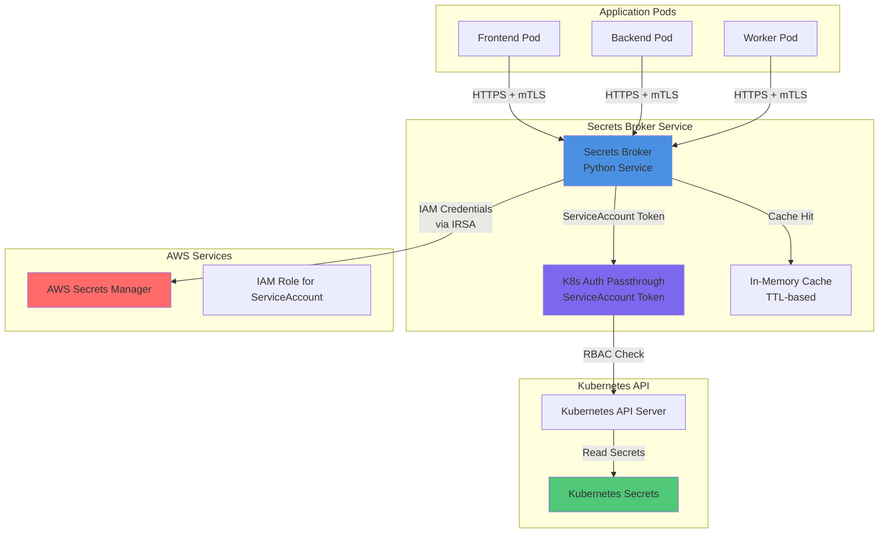
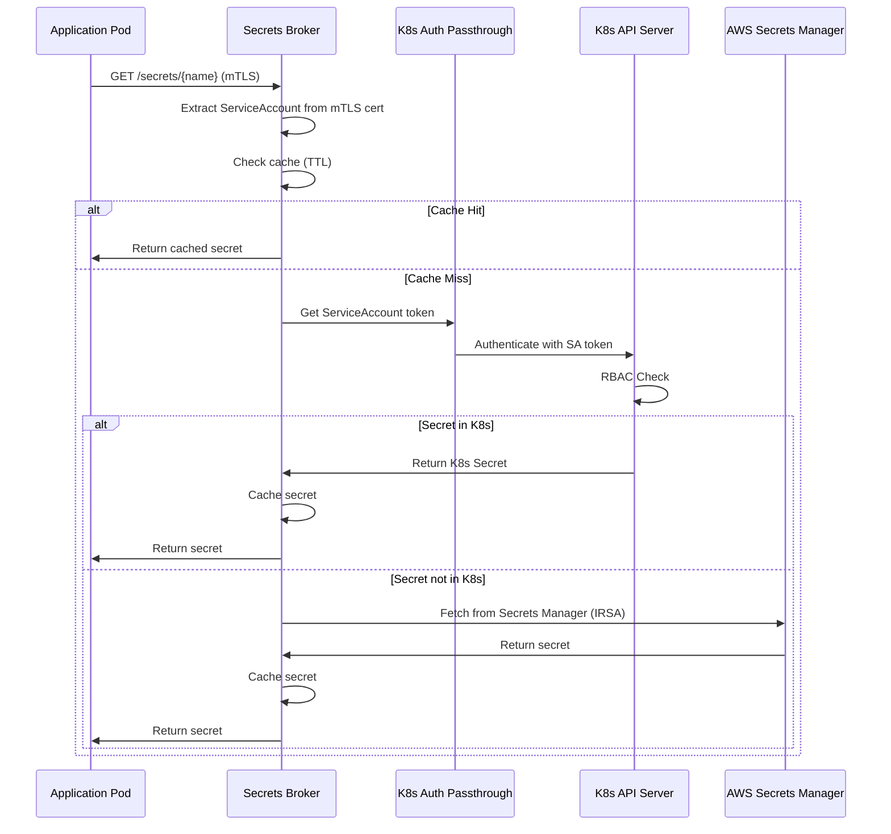
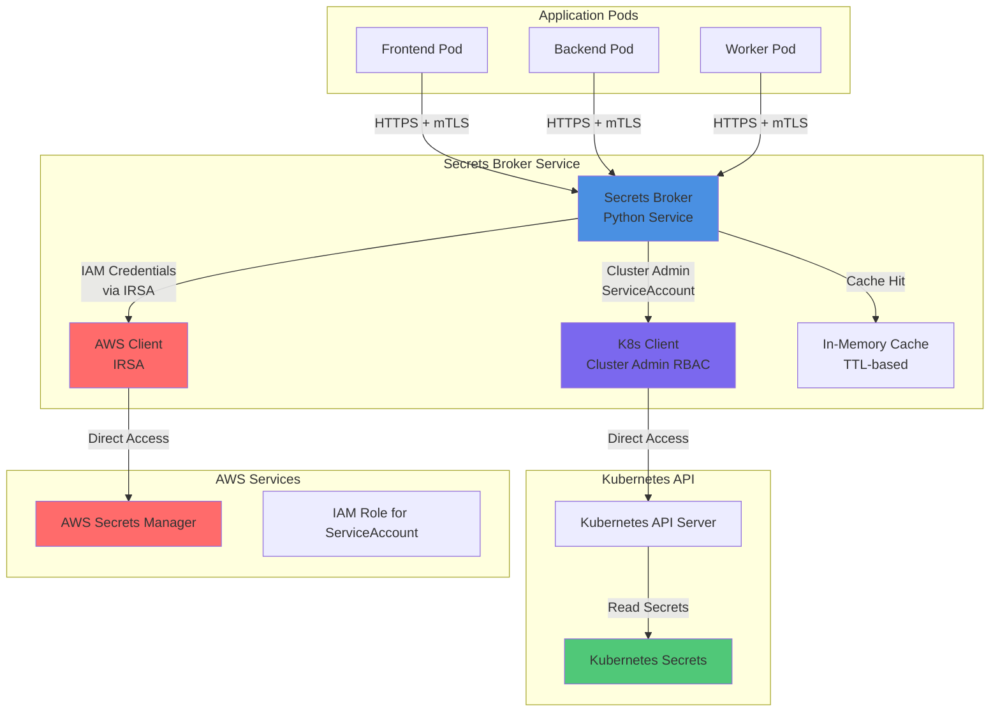
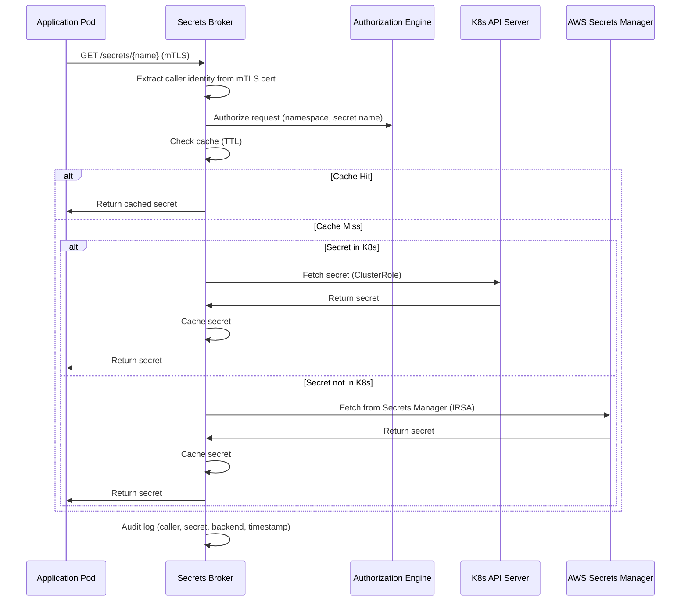
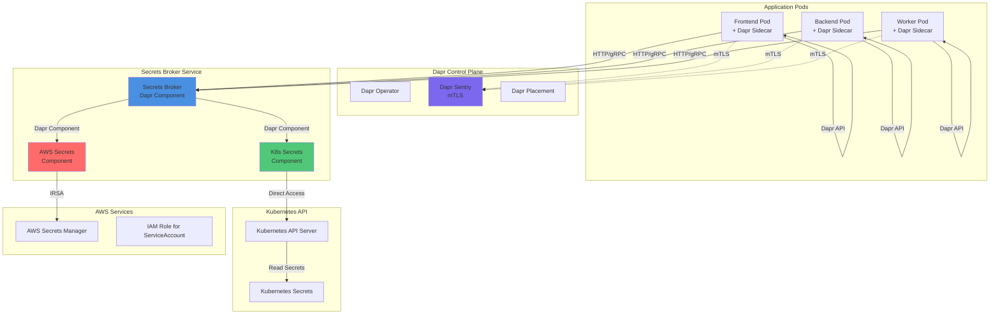
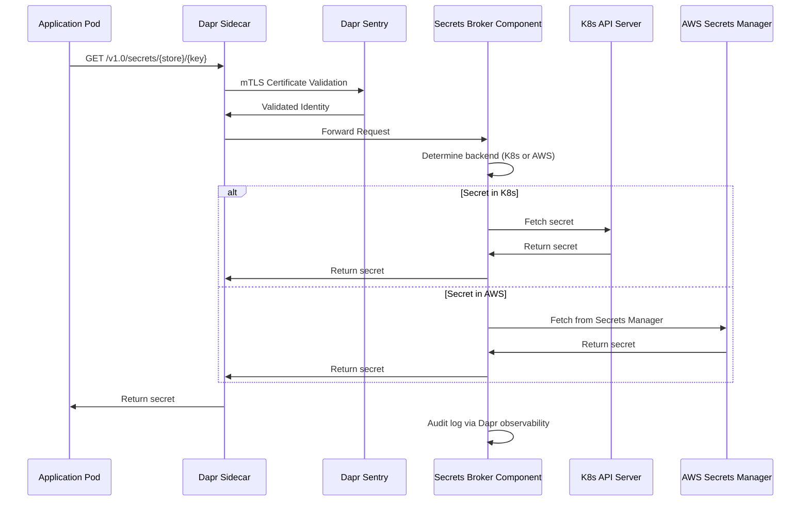
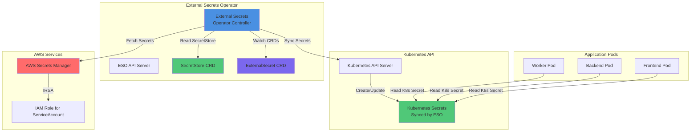
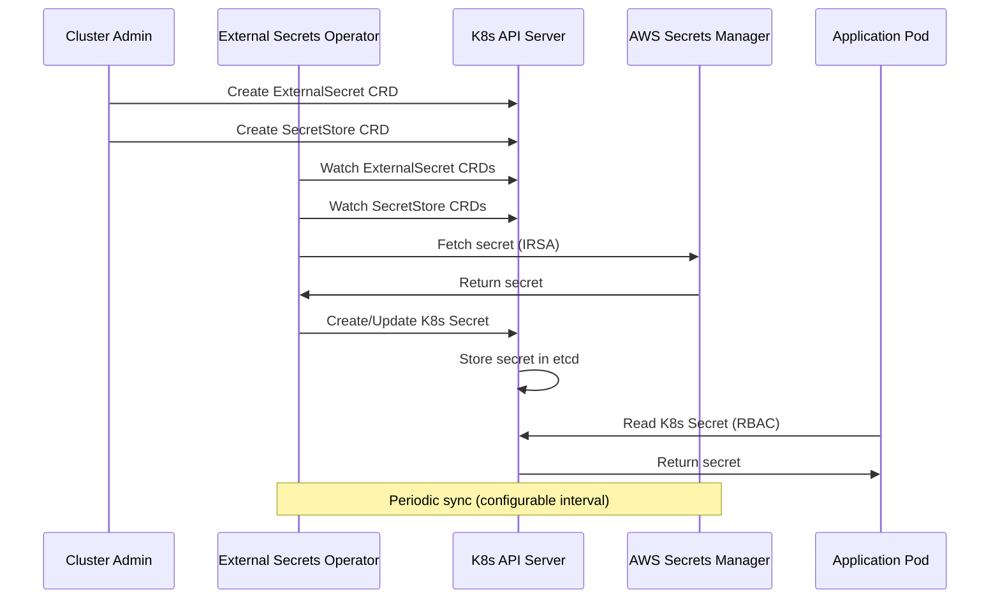
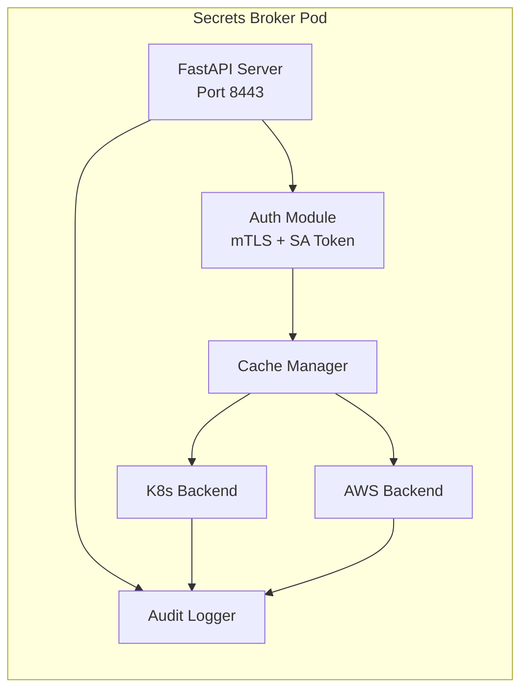

# ADR-001: Kubernetes Secrets Broker Service Architecture

## Status
**Proposed** | Date: 2024-12-19 | Authors: Platform Engineering Team

## Context

In air-gapped Kubernetes deployments, applications require secure access to secrets stored across multiple backends:
- Kubernetes Secrets (native K8s resources)
- AWS Secrets Manager (external cloud service)

Current challenges:
1. **Direct Secret Access Limitations**: Some applications cannot directly read Kubernetes Secrets due to RBAC constraints, security policies, or architectural patterns
2. **Multi-Backend Complexity**: Secrets exist in both Kubernetes Secrets and AWS Secrets Manager, requiring different access mechanisms
3. **Dynamic Secret Lifecycle**: Secrets are created at various times (before, during, or after application deployment), requiring just-in-time fetching capabilities
4. **Security Requirements**: Need for mTLS, auditability, and secure communication patterns
5. **Operational Overhead**: Mounting secrets as volumes/files creates coupling and reduces flexibility

## Decision Drivers

1. **Security**: mTLS support, auditability, least-privilege access
2. **Flexibility**: Support multiple secret backends (K8s Secrets, AWS Secrets Manager)
3. **Performance**: Lightweight service with minimal resource footprint
4. **Dynamic Access**: Just-in-time secret fetching without pre-mounting
5. **Air-Gapped Compatibility**: Must work in isolated environments
6. **Maintainability**: Python3-based service with comprehensive logging
7. **Backend Priority**: Check Kubernetes Secrets first, then fallback to configured backends

## Considered Options

### Option 1: Secrets Broker Service with AWS Secrets Manager + Kubernetes Secrets Support (Centralized Proxy with K8s Auth Passthrough)

#### Architecture



#### Description

A centralized Python service that acts as a proxy, leveraging Kubernetes ServiceAccount tokens for authentication passthrough. Applications authenticate to the broker using mTLS, and the broker uses the caller's ServiceAccount context to access Kubernetes Secrets, maintaining RBAC enforcement.

#### Flow Diagram



#### Pros
- ✅ Maintains Kubernetes RBAC enforcement through ServiceAccount passthrough
- ✅ Single point of access control and auditability
- ✅ Supports both K8s Secrets and AWS Secrets Manager
- ✅ Lightweight Python service
- ✅ mTLS support for secure communication
- ✅ Caching reduces API calls

#### Cons
- ❌ Requires ServiceAccount token management
- ❌ Additional network hop for secret access
- ❌ Cache invalidation complexity
- ❌ ServiceAccount token rotation handling needed

#### Implementation Notes
- Service extracts ServiceAccount identity from mTLS client certificate
- Uses Kubernetes client-go library with ServiceAccount token
- Implements TTL-based caching with configurable expiration
- Audit logs include: caller identity, secret name, backend source, timestamp

---

### Option 2: Secrets Broker Service with AWS Secrets Manager + Kubernetes Secrets Support (Direct Access)

#### Architecture



#### Description

A centralized Python service with elevated Kubernetes permissions (ClusterRole) that directly accesses both Kubernetes Secrets and AWS Secrets Manager. Applications authenticate via mTLS, and the broker performs authorization checks based on request metadata before fetching secrets.

#### Flow Diagram



#### Pros
- ✅ Simplified access model (no token passthrough)
- ✅ Centralized authorization logic
- ✅ Supports both backends seamlessly
- ✅ Lightweight Python service
- ✅ Full control over authorization policies

#### Cons
- ❌ Requires ClusterRole permissions (security concern)
- ❌ Authorization logic must be maintained separately from K8s RBAC
- ❌ Potential for privilege escalation if misconfigured
- ❌ Cache invalidation complexity

#### Implementation Notes
- Service runs with ClusterRole allowing secret read access
- Custom authorization engine validates caller identity against secret access policies
- Policies can be defined via ConfigMap or CRD
- Audit logs include: caller identity, secret name, backend source, authorization decision, timestamp

---

### Option 3: Secrets Broker Service using Dapr

#### Architecture



#### Description

Leverages Dapr (Distributed Application Runtime) as the secrets broker infrastructure. Applications use Dapr SDK/API to fetch secrets, and Dapr handles mTLS, service discovery, and component abstraction. Custom Dapr components are created for Kubernetes Secrets and AWS Secrets Manager integration.

#### Flow Diagram



#### Pros
- ✅ Built-in mTLS and service mesh capabilities
- ✅ Standardized API (Dapr Secrets API)
- ✅ Component abstraction for multiple backends
- ✅ Observability and tracing built-in
- ✅ No custom mTLS implementation needed

#### Cons
- ❌ Requires Dapr control plane (additional infrastructure)
- ❌ Sidecar pattern adds resource overhead per pod
- ❌ Learning curve for Dapr
- ❌ More complex deployment and operational overhead
- ❌ May be overkill for simple secret fetching

#### Implementation Notes
- Deploy Dapr control plane components (Operator, Sentry, Placement)
- Create custom Dapr secret store components for K8s and AWS
- Applications use Dapr SDK or HTTP API
- Audit logs via Dapr observability pipeline
- Backend priority logic implemented in custom components

---

### Option 4: External Secrets Operator (OSS Project)

#### Architecture



#### Description

Uses the open-source External Secrets Operator (ESO) to sync secrets from AWS Secrets Manager into Kubernetes Secrets. Applications read secrets from Kubernetes Secrets as usual. ESO watches ExternalSecret CRDs and continuously syncs secrets from external backends.

#### Flow Diagram



#### Pros
- ✅ Mature, production-ready OSS project
- ✅ Declarative secret management via CRDs
- ✅ Supports multiple backends (AWS, Azure, GCP, HashiCorp Vault, etc.)
- ✅ Automatic secret synchronization
- ✅ No custom code required
- ✅ Well-documented and community-supported

#### Cons
- ❌ Still requires applications to mount/read K8s Secrets (doesn't solve the core requirement)
- ❌ Not a just-in-time API service (secrets are synced, not fetched on-demand)
- ❌ CRD-based approach adds complexity
- ❌ Secrets are stored in etcd (potential security concern)
- ❌ Doesn't provide mTLS API interface
- ❌ Less flexible for dynamic secret fetching scenarios

#### Implementation Notes
- Deploy External Secrets Operator via Helm or manifests
- Create SecretStore CRDs for AWS Secrets Manager
- Create ExternalSecret CRDs for each secret to sync
- Applications read synced Kubernetes Secrets
- Audit logs via ESO controller logs and Kubernetes audit logs

---

## Decision Outcome

**Chosen Option: Option 1 - Secrets Broker Service with AWS Secrets Manager + Kubernetes Secrets Support (Centralized Proxy with K8s Auth Passthrough)**

### Rationale

1. **Meets Core Requirements**: Provides just-in-time API-based secret fetching without mounting secrets
2. **Security**: Maintains Kubernetes RBAC enforcement through ServiceAccount passthrough, ensuring least-privilege access
3. **Flexibility**: Supports dynamic secret fetching from multiple backends with configurable priority
4. **Lightweight**: Python3 service with minimal dependencies, suitable for distroless containers
5. **Auditability**: Centralized logging of all secret access requests with caller identity
6. **mTLS Support**: Built-in mTLS for secure pod-to-service communication
7. **Air-Gapped Compatible**: No external dependencies beyond Kubernetes API and AWS APIs

### Comparison Matrix

| Criteria | Option 1 | Option 2 | Option 3 | Option 4 |
|----------|----------|----------|----------|----------|
| Just-in-Time API | ✅ | ✅ | ✅ | ❌ |
| No Secret Mounting | ✅ | ✅ | ✅ | ❌ |
| K8s RBAC Enforcement | ✅ | ⚠️ | ✅ | ✅ |
| mTLS Support | ✅ | ✅ | ✅ | ❌ |
| Lightweight | ✅ | ✅ | ❌ | ✅ |
| Dynamic Secret Fetching | ✅ | ✅ | ✅ | ⚠️ |
| Auditability | ✅ | ✅ | ✅ | ⚠️ |
| Operational Complexity | Medium | Low | High | Medium |

## Consequences

### Positive

1. **Security**: RBAC enforcement maintained through ServiceAccount passthrough
2. **Flexibility**: Applications can fetch secrets dynamically via API calls
3. **Centralized Control**: Single point for secret access policies and audit logging
4. **Backend Agnostic**: Easy to add additional secret backends in the future
5. **Performance**: Caching reduces load on Kubernetes API and AWS Secrets Manager

### Negative

1. **Additional Service**: Requires deployment and maintenance of the secrets broker service
2. **Network Latency**: Additional network hop for secret access (mitigated by caching)
3. **Token Management**: Need to handle ServiceAccount token rotation and refresh
4. **Cache Invalidation**: Requires logic to invalidate cache when secrets are updated
5. **Single Point of Failure**: Service availability critical for application startup (mitigated by high availability deployment)

### Mitigation Strategies

1. **High Availability**: Deploy multiple replicas with pod disruption budgets
2. **Caching**: Implement TTL-based caching with configurable expiration
3. **Health Checks**: Comprehensive health endpoints for Kubernetes liveness/readiness probes
4. **Circuit Breakers**: Implement circuit breakers for backend failures
5. **Monitoring**: Comprehensive metrics and alerting for service health
6. **Token Refresh**: Automatic ServiceAccount token refresh with retry logic

## Implementation Plan

### Phase 1: Core Service (Weeks 1-2)
- Python3 FastAPI service with mTLS support
- Kubernetes Secrets backend integration
- ServiceAccount token passthrough mechanism
- Basic caching implementation
- Health check endpoints

### Phase 2: AWS Integration (Week 3)
- AWS Secrets Manager integration
- IRSA (IAM Role for ServiceAccount) configuration
- Backend priority logic (K8s first, then AWS)
- Error handling and fallback mechanisms

### Phase 3: Security & Observability (Week 4)
- Comprehensive audit logging
- Request metadata extraction (caller identity, namespace, etc.)
- Debug logging via environment variable
- Metrics and Prometheus integration

### Phase 4: Production Hardening (Week 5)
- Distroless container image optimization
- Resource limits and requests
- Security policies (PodSecurityPolicy/PSA)
- Documentation and runbooks

### Phase 5: Testing & Validation (Week 6)
- Integration tests
- Load testing
- Security testing (penetration testing)
- Air-gapped environment validation

## Technical Specifications

### Service Architecture



### API Endpoints

```
GET  /healthz                    # Health check
GET  /readyz                     # Readiness check
GET  /metrics                    # Prometheus metrics
GET  /v1/secrets/{name}          # Fetch secret by name
GET  /v1/secrets/{name}/{key}    # Fetch specific key from secret
POST /v1/secrets/batch           # Batch fetch multiple secrets
```

### Environment Variables

```bash
# Backend Configuration
SECRETS_BACKEND=k8s,aws-secrets-manager
K8S_NAMESPACE=default
AWS_REGION=us-east-1
AWS_SECRETS_MANAGER_PREFIX=/app/secrets

# Security
MTLS_ENABLED=true
MTLS_CA_CERT_PATH=/etc/tls/ca.crt
MTLS_SERVER_CERT_PATH=/etc/tls/server.crt
MTLS_SERVER_KEY_PATH=/etc/tls/server.key

# Caching
CACHE_ENABLED=true
CACHE_TTL_SECONDS=300
CACHE_MAX_SIZE=1000

# Logging
LOG_LEVEL=INFO
DEBUG_MODE=false
AUDIT_LOG_ENABLED=true
AUDIT_LOG_PATH=/var/log/secrets-broker/audit.log

# Service Configuration
SERVER_PORT=8443
WORKERS=4
```

### Kubernetes Resources

```yaml
# ServiceAccount with IRSA annotation
apiVersion: v1
kind: ServiceAccount
metadata:
  name: secrets-broker
  annotations:
    eks.amazonaws.com/role-arn: arn:aws:iam::ACCOUNT:role/secrets-broker-role
---
# ClusterRole for reading secrets
apiVersion: rbac.authorization.k8s.io/v1
kind: ClusterRole
metadata:
  name: secrets-broker-reader
rules:
- apiGroups: [""]
  resources: ["secrets"]
  verbs: ["get", "list"]
---
# ClusterRoleBinding
apiVersion: rbac.authorization.k8s.io/v1
kind: ClusterRoleBinding
metadata:
  name: secrets-broker-binding
roleRef:
  apiGroup: rbac.authorization.k8s.io
  kind: ClusterRole
  name: secrets-broker-reader
subjects:
- kind: ServiceAccount
  name: secrets-broker
  namespace: platform
```

### Container Image

- **Base**: `gcr.io/distroless/python3-debian12:latest`
- **Size**: ~50MB (estimated)
- **Python Version**: 3.11+
- **Dependencies**: FastAPI, kubernetes, boto3, cryptography

## Monitoring & Observability

### Metrics

- `secrets_broker_requests_total` - Total API requests
- `secrets_broker_requests_duration_seconds` - Request latency
- `secrets_broker_cache_hits_total` - Cache hit count
- `secrets_broker_cache_misses_total` - Cache miss count
- `secrets_broker_backend_errors_total` - Backend error count
- `secrets_broker_secrets_fetched_total` - Secrets fetched by backend

### Audit Log Format

```json
{
  "timestamp": "2024-12-19T10:30:00Z",
  "caller": {
    "service_account": "frontend-service",
    "namespace": "production",
    "pod": "frontend-abc123"
  },
  "request": {
    "method": "GET",
    "path": "/v1/secrets/database-credentials",
    "secret_name": "database-credentials"
  },
  "response": {
    "status_code": 200,
    "backend": "kubernetes",
    "cache_hit": true
  },
  "duration_ms": 15
}
```

## Security Considerations

1. **mTLS**: All client connections require valid mTLS certificates
2. **RBAC**: ServiceAccount passthrough maintains Kubernetes RBAC enforcement
3. **Secret Encryption**: Secrets in transit encrypted via TLS, secrets at rest encrypted by backend
4. **Audit Logging**: All secret access logged with caller identity
5. **Least Privilege**: ServiceAccount has minimal required permissions
6. **Network Policies**: Restrict network access to secrets broker service
7. **Pod Security**: Run with non-root user, read-only root filesystem

## References

- [Kubernetes Secrets Documentation](https://kubernetes.io/docs/concepts/configuration/secret/)
- [AWS Secrets Manager Documentation](https://docs.aws.amazon.com/secretsmanager/)
- [FastAPI Documentation](https://fastapi.tiangolo.com/)
- [Distroless Images](https://github.com/GoogleContainerTools/distroless)
- [External Secrets Operator](https://external-secrets.io/)

