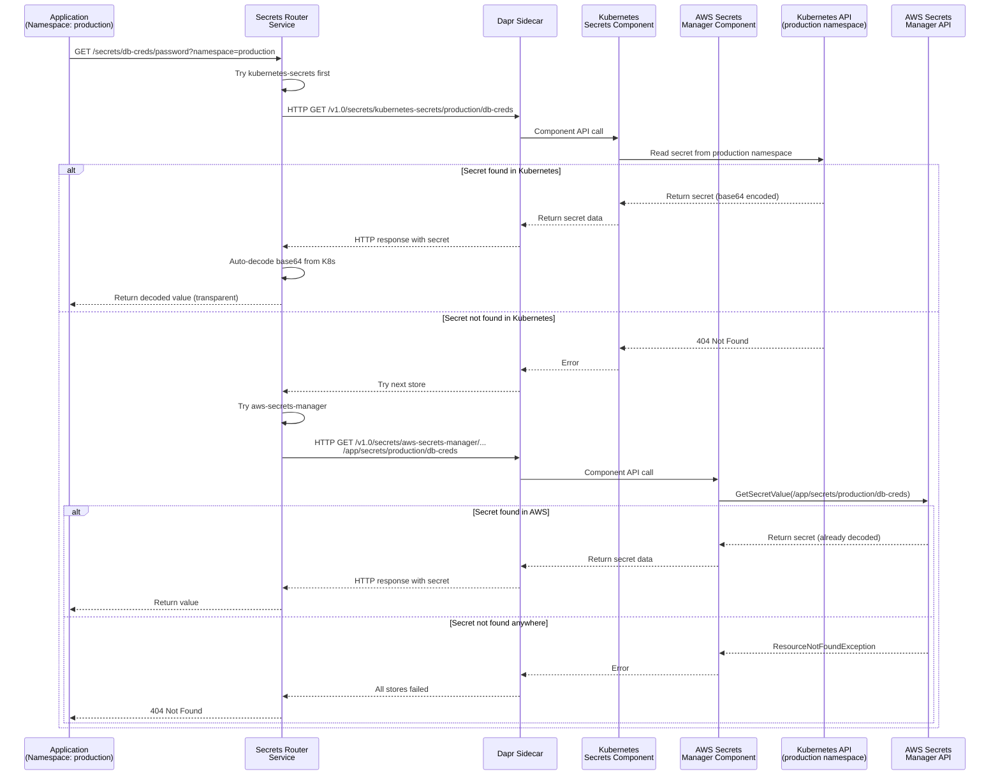
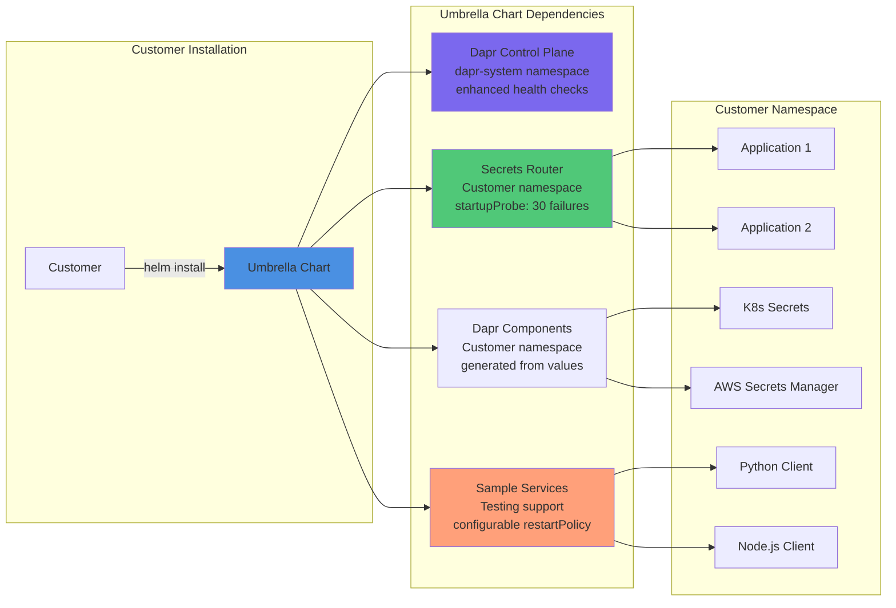

# Secrets Broker Architecture

## Overview

The Secrets Broker is deployed as a **control-plane-umbrella Helm chart** that includes:
- **Dapr Control Plane**: Provides mTLS and component abstraction (installed as a dependency)
- **Secrets Router Service**: HTTP API service that routes secret requests to Dapr components (installed as a dependency)
- **Dapr Components**: Configurable secret store components (Kubernetes Secrets and AWS Secrets Manager) generated from Helm values

## Chart Structure

```
control-plane-umbrella (umbrella chart)
├── dapr (dependency)
│   └── Dapr control plane components
└── secrets-router (dependency)
    ├── secrets-router service deployment
    └── secrets-components.yaml (generates Dapr Component resources)
```

The `secrets-router` chart has its own dependency on `dapr`, ensuring Dapr is available when secrets-router is deployed.

## Architecture Diagram

```mermaid
graph TB
    subgraph "Customer Namespace (e.g., production)"
        subgraph "Application Pods"
            APP1[App Pod 1]
            APP2[App Pod 2]
            APP3[App Pod 3]
        end
        
        subgraph "Secrets Router Pod"
            ROUTER[Secrets Router<br/>FastAPI Service<br/>Port 8080]
            DAPR_SIDECAR[Dapr Sidecar<br/>Port 3500]
            ROUTER <-->|localhost:3500| DAPR_SIDECAR
        end
        
        subgraph "Dapr Components"
            K8S_COMP[Kubernetes Secrets<br/>Component]
            AWS_COMP[AWS Secrets Manager<br/>Component]
        end
        
        subgraph "Kubernetes Secrets"
            K8S_SECRET1[database-credentials]
            K8S_SECRET2[api-keys]
        end
    end
    
    subgraph "Dapr Control Plane (dapr-system)"
        DAPR_OP[Dapr Operator]
        DAPR_SENTRY[Dapr Sentry<br/>mTLS]
        DAPR_PLACEMENT[Dapr Placement]
    end
    
    subgraph "AWS Services"
        AWS_SM["AWS Secrets Manager<br/>Path: /app/secrets/namespace/secret"]
        IRSA[IAM Role for ServiceAccount]
    end
    
    APP1 -->|HTTP GET /secrets/{name}/{key}?namespace=production| ROUTER
    APP2 -->|HTTP GET /secrets/{name}/{key}?namespace=production| ROUTER
    APP3 -->|HTTP GET /secrets/{name}/{key}?namespace=production| ROUTER
    
    ROUTER -->|HTTP localhost:3500| DAPR_SIDECAR
    DAPR_SIDECAR -->|Component API| K8S_COMP
    DAPR_SIDECAR -->|Component API| AWS_COMP
    
    K8S_COMP -->|Read Secret| K8S_SECRET1
    K8S_COMP -->|Read Secret| K8S_SECRET2
    
    AWS_COMP -->|GetSecretValue| AWS_SM
    AWS_COMP -.->|IRSA| IRSA
    
    DAPR_SIDECAR -.->|mTLS| DAPR_SENTRY
    
    style ROUTER fill:#50c878
    style DAPR_SIDECAR fill:#4a90e2
    style K8S_COMP fill:#7b68ee
    style AWS_COMP fill:#ff6b6b
    style K8S_SECRET1 fill:#87ceeb
    style K8S_SECRET2 fill:#87ceeb
    style AWS_SM fill:#ffa07a
```

## Secret Resolution Flow



## Key Architectural Decisions

### 1. Namespace-Scoped Architecture

- **All secrets are namespace-scoped** - no cluster-wide secrets
- Applications access secrets from their deployment namespace
- Namespace is **required** in API requests
- Provides isolation between environments (production, staging, dev)

### 2. Umbrella Chart Deployment

- Customer installs `control-plane-umbrella` chart
- Chart includes Dapr control plane and Secrets Router as dependencies
- Secrets Router chart has its own dependency on Dapr
- All components deployed to customer's namespace (determined by `{{ .Release.Namespace }}`)
- Simplified deployment and management
- Users provide `override.yaml` to configure secret store locations

### 3. Auto-Decoding of Kubernetes Secrets

- Kubernetes Secrets are base64 encoded by default
- Secrets Router **automatically decodes** K8s secrets before returning
- All secrets returned as decoded values ready for use
- Transparent to application developers
- AWS Secrets Manager values are already decoded (no change needed)

### 4. AWS Secrets Manager Configuration

- AWS secrets can use full paths configured in Helm chart values
- Secret names can be simple names (mapped to paths via Helm config) or full paths
- Example: Configure `database-credentials: "/app/secrets/production/database-credentials"` in Helm values
- Allows flexible secret path management

### 5. Priority-Based Resolution

- Tries Kubernetes Secrets first (faster, local)
- Falls back to AWS Secrets Manager if not found
- Configurable via `SECRET_STORE_PRIORITY` environment variable
- Default: `kubernetes-secrets,aws-secrets-manager`

## Component Details

### Secrets Router Service

- **Language**: Python 3.11
- **Framework**: FastAPI
- **Image**: Distroless Python (~50MB)
- **Port**: 8080
- **Health Checks**: Comprehensive probe configuration for Dapr timing
  - **Liveness Probe**: `/healthz` with 30s initial delay
  - **Readiness Probe**: `/readyz` with 30s initial delay, checks Dapr sidecar connectivity
  - **Startup Probe**: `/healthz` with 10s initial delay and 30 failure threshold
- **Endpoints**:
  - `GET /healthz` - Health check (basic service status)
  - `GET /readyz` - Readiness check (Dapr sidecar connectivity)
  - `GET /secrets/{secret_name}/{secret_key}?namespace={ns}` - Get secret (always decoded)

#### Health Check Architecture

The enhanced health check configuration specifically addresses Dapr initialization timing issues:

```yaml
# Enhanced health check configuration in charts/secrets-router/values.yaml
healthChecks:
  liveness:
    enabled: true
    path: /healthz
    initialDelaySeconds: 30
    periodSeconds: 10
  readiness:
    enabled: true
    path: /readyz
    initialDelaySeconds: 30
    periodSeconds: 5
    timeoutSeconds: 5
    failureThreshold: 3
  startupProbe:
    enabled: true
    path: /healthz
    initialDelaySeconds: 10
    periodSeconds: 10
    timeoutSeconds: 5
    failureThreshold: 30  # Extended for Dapr timing issues
```

**Health Check Integration**:
- **Startup Probe**: Provides extended window (up to 5 minutes) for Dapr sidecar initialization
- **Readiness Probe**: Verifies Dapr sidecar connectivity before marking service as ready
- **Response Differentiation**: `/readyz` returns HTTP 503 when Dapr sidecar is disconnected
- **Dapr Timing Resolution**: Prevents premature container restarts during Dapr sidecar injection

#### Restart Policy Configuration

The service uses appropriate restart policies for different resource types:

- **secrets-router**: Deployment resource with `restartPolicy: Always` (standard for stateless services)
- **sample-services**: Pod resources with configurable restartPolicy (default: `Always`)
  - Enables testing with different restart behaviors
  - Supports development scenarios with `Never` or `OnFailure` policies

**Configuration Example**:
```yaml
# From charts/secrets-router/values.yaml
deployment:
  replicas: 1
  restartPolicy: Always  # Standard for Deployment resources

# From charts/sample-service/values.yaml  
restartPolicy: Always    # Configurable for test scenarios
```

### Dapr Components

#### Kubernetes Secrets Component
- **Type**: `secretstores.kubernetes`
- **Format**: `{namespace}/{secret-name}`
- **Auto-decoding**: Yes (base64 → plain text)

#### AWS Secrets Manager Component
- **Type**: `secretstores.aws.secretsmanager`
- **Format**: Full path (configured in Helm values) or simple name
- **Auto-decoding**: No (already decoded)

## Deployment Model with Enhanced Health Management



### Enhanced Deployment Features

#### Health Check Integration
- **Startup Probe**: Extended failure threshold (30) handles Dapr sidecar timing
- **Readiness Probe**: Validates Dapr connectivity before accepting traffic
- **Liveness Probe**: Standard health monitoring with appropriate delays
- **Service Discovery**: Comprehensive DNS connectivity validation

#### Restart Policy Management
- **Deployment Resources**: Standard `restartPolicy: Always` for production stability
- **Pod Resources**: Configurable restartPolicy for test scenarios and debugging
- **Container Images**: Development vs production pull policies (Never vs Always)

#### Testing Infrastructure Integration
- **Minimal Override Methodology**: Override files contain only values different from chart defaults
- **Namespace Isolation**: Each test scenario in isolated namespace
- **Automated Orchestrator**: Builds containers and manages dependencies efficiently
- **Health Validation**: StartupProbe allows adequate time for Dapr initialization

### Container Build and Image Management

#### Production Deployment
```yaml
# Production image configuration
secrets-router:
  image:
    repository: secrets-router
    pullPolicy: Always  # Ensure latest images in production
  deployment:
    restartPolicy: Always  # Standard for reliability
```

#### Local Development/Testing
```yaml
# Local testing configuration (override.yaml)
secrets-router:
  image:
    pullPolicy: Never  # Use locally built images
  deployment:
    restartPolicy: Always  # Standard even for testing

sample-service:
  restartPolicy: Never  # Optional: prevent restarts during debugging
```

## Security Model

1. **Namespace Isolation**: Secrets are isolated by namespace
2. **mTLS**: All communication secured via Dapr Sentry
3. **RBAC**: Kubernetes RBAC enforced for K8s secrets access
4. **IRSA**: AWS IAM Roles for ServiceAccounts for AWS access
5. **Read-Only**: Service only reads secrets, never writes
6. **Audit Logging**: All secret access logged with caller metadata

## Configuration

### Umbrella Chart Values

The umbrella chart `values.yaml` contains only high-level enable/disable flags:

```yaml
# charts/umbrella/values.yaml
dapr:
  enabled: true

secrets-router:
  enabled: true
```

**Default configurations** are defined in the child chart's `values.yaml` files:
- `charts/secrets-router/values.yaml` - Contains all default configurations for Secrets Router
- Dapr chart uses its own default values

**Customization** is done via `override.yaml`:

```yaml
# override.yaml - Override only what you need to customize
secrets-router:
  # Override secret store namespaces
  secretStores:
    stores:
      kubernetes-secrets:
        namespaces:
          - production
          - staging
          - shared-services
  
  # Override other settings as needed
  env:
    SECRET_STORE_PRIORITY: "kubernetes-secrets,aws-secrets-manager"
```

### Dapr Components

Dapr Components are **generated automatically** from Helm values via `secrets-components.yaml` template:
- Components are created in the release namespace (`{{ .Release.Namespace }}`)
- `kubernetes-secrets` component configured with allowed namespaces
- `aws-secrets-manager` component (if AWS configured)
- Developers update `override.yaml` to add new namespaces or secret stores

## Developer Workflow

### Creating Secrets

1. **Developer creates secrets** in their namespace (or any namespace):
   ```bash
   kubectl create secret generic my-secret \
     --from-literal=password=secret123 \
     -n production
   ```

2. **Developer updates `override.yaml`** to include the namespace:
   ```yaml
   secrets-router:
     secretStores:
       stores:
         kubernetes-secrets:
           namespaces:
             - production  # Add this namespace
             - staging
   ```

3. **Upgrade the helm release**:
   ```bash
   helm upgrade control-plane ./charts/umbrella -f override.yaml
   ```

4. **Application accesses secret** via Secrets Router API:
   ```bash
   curl http://secrets-router:8080/secrets/my-secret/password?namespace=production
   ```

### Individual Service Helm Charts

Service helm charts that are part of the control-plane-umbrella can:

1. **Reference secrets-router service** by name:
   ```yaml
   # In service deployment
   env:
     - name: DB_PASSWORD
       valueFrom:
         httpGet:
           path: /secrets/database-credentials/password?namespace={{ .Release.Namespace }}
           port: 8080
           host: secrets-router
   ```

2. **Or use HTTP client libraries** to fetch secrets at runtime (recommended)

3. **Ensure namespace is configured** in `override.yaml` if secrets are in different namespaces

## Benefits

1. **Simple Deployment**: Single umbrella chart installs everything
2. **Flexible Configuration**: Developers configure secret locations via `override.yaml`
3. **Namespace Support**: Secrets can be accessed from multiple namespaces
4. **Developer Friendly**: Simple HTTP API, auto-decoding
5. **Flexible**: Supports both K8s and AWS secrets
6. **Secure**: mTLS, RBAC, audit logging
7. **Transparent**: Auto-decoding hides complexity from developers
8. **Streamlined**: Update `override.yaml` to add new secret locations, no code changes needed

