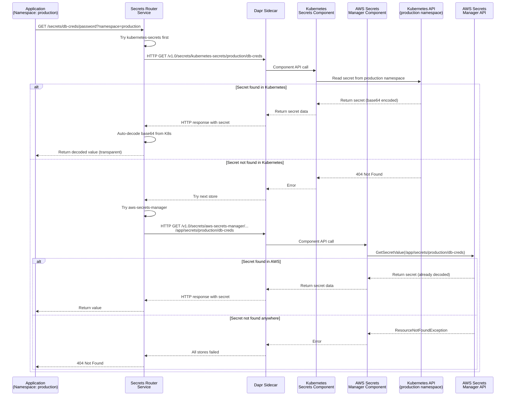
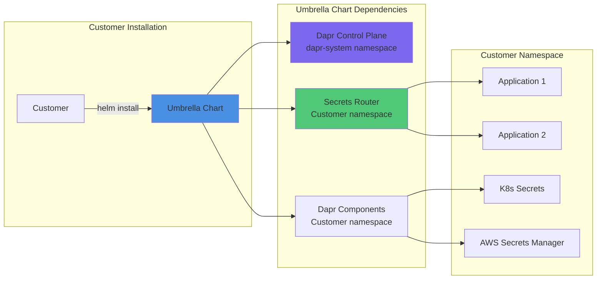

# Secrets Broker Architecture

## Overview

The Secrets Broker is deployed as an **umbrella Helm chart** that includes:
- **Dapr Control Plane**: Provides mTLS and component abstraction
- **Secrets Router Service**: HTTP API service that routes secret requests to Dapr components
- **Dapr Components**: Kubernetes Secrets and AWS Secrets Manager integrations

## Architecture Diagram

```mermaid
graph TB
    subgraph "Customer Namespace (e.g., production)"
        subgraph "Application Pods"
            APP1[App Pod 1]
            APP2[App Pod 2]
            APP3[App Pod 3]
        end
        
        subgraph "Secrets Router Pod"
            ROUTER[Secrets Router<br/>FastAPI Service<br/>Port 8080]
            DAPR_SIDECAR[Dapr Sidecar<br/>Port 3500]
            ROUTER <-->|localhost:3500| DAPR_SIDECAR
        end
        
        subgraph "Dapr Components"
            K8S_COMP[Kubernetes Secrets<br/>Component]
            AWS_COMP[AWS Secrets Manager<br/>Component]
        end
        
        subgraph "Kubernetes Secrets"
            K8S_SECRET1[database-credentials]
            K8S_SECRET2[api-keys]
        end
    end
    
    subgraph "Dapr Control Plane (dapr-system)"
        DAPR_OP[Dapr Operator]
        DAPR_SENTRY[Dapr Sentry<br/>mTLS]
        DAPR_PLACEMENT[Dapr Placement]
    end
    
    subgraph "AWS Services"
        AWS_SM[AWS Secrets Manager<br/>Path: /app/secrets/{namespace}/{secret}]
        IRSA[IAM Role for ServiceAccount]
    end
    
    APP1 -->|HTTP GET /secrets/{name}/{key}?namespace=production| ROUTER
    APP2 -->|HTTP GET /secrets/{name}/{key}?namespace=production| ROUTER
    APP3 -->|HTTP GET /secrets/{name}/{key}?namespace=production| ROUTER
    
    ROUTER -->|HTTP localhost:3500| DAPR_SIDECAR
    DAPR_SIDECAR -->|Component API| K8S_COMP
    DAPR_SIDECAR -->|Component API| AWS_COMP
    
    K8S_COMP -->|Read Secret| K8S_SECRET1
    K8S_COMP -->|Read Secret| K8S_SECRET2
    
    AWS_COMP -->|GetSecretValue| AWS_SM
    AWS_COMP -.->|IRSA| IRSA
    
    DAPR_SIDECAR -.->|mTLS| DAPR_SENTRY
    
    style ROUTER fill:#50c878
    style DAPR_SIDECAR fill:#4a90e2
    style K8S_COMP fill:#7b68ee
    style AWS_COMP fill:#ff6b6b
    style K8S_SECRET1 fill:#87ceeb
    style K8S_SECRET2 fill:#87ceeb
    style AWS_SM fill:#ffa07a
```

## Secret Resolution Flow



## Key Architectural Decisions

### 1. Namespace-Scoped Architecture

- **All secrets are namespace-scoped** - no cluster-wide secrets
- Applications access secrets from their deployment namespace
- Namespace is **required** in API requests
- Provides isolation between environments (production, staging, dev)

### 2. Umbrella Chart Deployment

- Customer installs a single umbrella chart
- Chart includes Dapr control plane and Secrets Router as dependencies
- All components deployed to customer's namespace
- Simplified deployment and management

### 3. Auto-Decoding of Kubernetes Secrets

- Kubernetes Secrets are base64 encoded by default
- Secrets Router **automatically decodes** K8s secrets before returning
- Transparent to application developers
- AWS Secrets Manager values are already decoded (no change needed)

### 4. Path-Based AWS Secrets Manager

- AWS secrets use path-based naming: `{prefix}/{namespace}/{secret-name}`
- Path prefix configurable via Helm values (default: `/app/secrets`)
- Example: `/app/secrets/production/database-credentials`
- Allows organization of secrets by namespace/environment

### 5. Priority-Based Resolution

- Tries Kubernetes Secrets first (faster, local)
- Falls back to AWS Secrets Manager if not found
- Configurable via `SECRET_STORE_PRIORITY` environment variable
- Default: `kubernetes-secrets,aws-secrets-manager`

## Component Details

### Secrets Router Service

- **Language**: Python 3.11
- **Framework**: FastAPI
- **Image**: Distroless Python (~50MB)
- **Port**: 8080
- **Endpoints**:
  - `GET /healthz` - Health check
  - `GET /readyz` - Readiness check
  - `GET /secrets/{secret_name}/{secret_key}?namespace={ns}&decode={bool}` - Get secret

### Dapr Components

#### Kubernetes Secrets Component
- **Type**: `secretstores.kubernetes`
- **Format**: `{namespace}/{secret-name}`
- **Auto-decoding**: Yes (base64 → plain text)

#### AWS Secrets Manager Component
- **Type**: `secretstores.aws.secretsmanager`
- **Format**: `{path-prefix}/{namespace}/{secret-name}`
- **Auto-decoding**: No (already decoded)

## Deployment Model



## Security Model

1. **Namespace Isolation**: Secrets are isolated by namespace
2. **mTLS**: All communication secured via Dapr Sentry
3. **RBAC**: Kubernetes RBAC enforced for K8s secrets access
4. **IRSA**: AWS IAM Roles for ServiceAccounts for AWS access
5. **Read-Only**: Service only reads secrets, never writes
6. **Audit Logging**: All secret access logged with caller metadata

## Configuration

### Umbrella Chart Values

```yaml
global:
  namespace: production  # Customer's namespace

dapr:
  enabled: true

secrets-router:
  enabled: true
  env:
    SECRET_STORE_PRIORITY: "kubernetes-secrets,aws-secrets-manager"
    AWS_SECRETS_PATH_PREFIX: "/app/secrets"
  awsSecretsPathPrefix: "/app/secrets"
```

### Dapr Components

Deployed automatically with umbrella chart:
- `kubernetes-secrets` component
- `aws-secrets-manager` component (if AWS configured)

## Benefits

1. **Simple Deployment**: Single umbrella chart installs everything
2. **Namespace Isolation**: Secrets scoped to namespace
3. **Developer Friendly**: Simple HTTP API, auto-decoding
4. **Flexible**: Supports both K8s and AWS secrets
5. **Secure**: mTLS, RBAC, audit logging
6. **Transparent**: Auto-decoding hides complexity from developers

