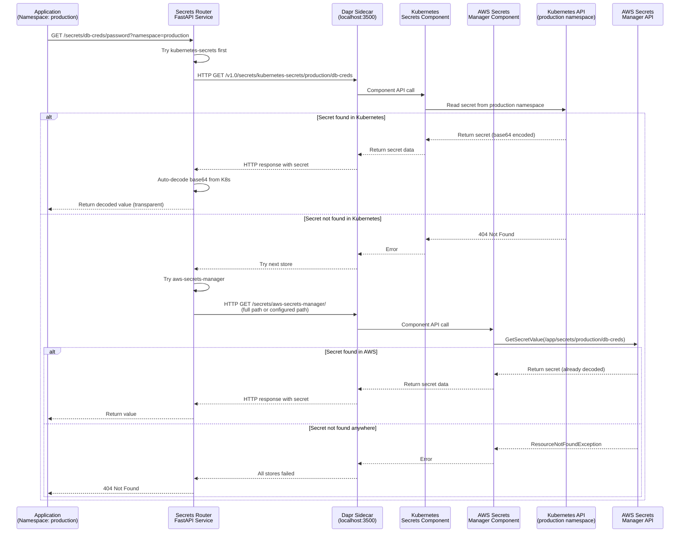
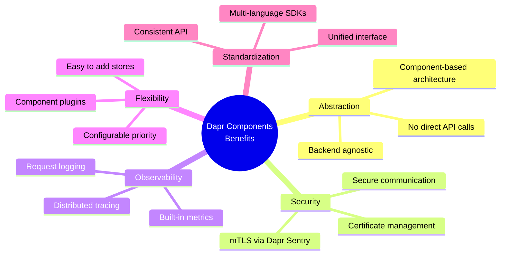

# Dapr Integration Guide

This guide explains how the secrets-router service uses Dapr components to fetch secrets.

**Note**: This service does NOT require a Dapr component for itself. It directly queries Dapr secret store components (kubernetes-secrets, aws-secrets-manager) via HTTP requests to the Dapr sidecar.

## Architecture

```mermaid
graph TB
    subgraph "Customer Namespace (e.g., production)"
        subgraph "Application Pods"
            APP1[App Pod 1]
            APP2[App Pod 2]
        end
        
        subgraph "Secrets Router Pod"
            FASTAPI[FastAPI Service<br/>Port 8080]
            ROUTER_SIDECAR[Dapr Sidecar<br/>Port 3500 HTTP]
            FASTAPI <-->|HTTP localhost:3500| ROUTER_SIDECAR
        end
        
        subgraph "Dapr Components"
            K8S_COMP[Kubernetes Secrets<br/>Component<br/>secretstores.kubernetes]
            AWS_COMP[AWS Secrets Manager<br/>Component<br/>secretstores.aws.secretsmanager]
        end
        
        subgraph "Kubernetes Secrets"
            K8S_SECRET1[database-credentials<br/>Namespace: production]
            K8S_SECRET2[api-keys<br/>Namespace: production]
        end
    end
    
    subgraph "Dapr Control Plane (dapr-system)"
        DAPR_SENTRY[Dapr Sentry<br/>mTLS]
    end
    
    subgraph "AWS Services"
        AWS_SM[AWS Secrets Manager<br/>Path: /app/secrets/production/{secret}]
        IRSA[IAM Role for ServiceAccount]
    end
    
    APP1 -->|HTTP GET /secrets/{name}/{key}?namespace=production| FASTAPI
    APP2 -->|HTTP GET /secrets/{name}/{key}?namespace=production| FASTAPI
    
    FASTAPI -->|HTTP GET /v1.0/secrets/kubernetes-secrets/{namespace}/{name}| ROUTER_SIDECAR
    FASTAPI -->|HTTP GET /v1.0/secrets/aws-secrets-manager/{path}| ROUTER_SIDECAR
    
    ROUTER_SIDECAR -->|Component API| K8S_COMP
    ROUTER_SIDECAR -->|Component API| AWS_COMP
    
    K8S_COMP -->|Read Secret| K8S_SECRET1
    K8S_COMP -->|Read Secret| K8S_SECRET2
    
    AWS_COMP -->|GetSecretValue| AWS_SM
    AWS_COMP -.->|IRSA| IRSA
    
    ROUTER_SIDECAR -.->|mTLS| DAPR_SENTRY
    
    style FASTAPI fill:#50c878
    style ROUTER_SIDECAR fill:#4a90e2
    style K8S_COMP fill:#7b68ee
    style AWS_COMP fill:#ff6b6b
    style K8S_SECRET1 fill:#87ceeb
    style K8S_SECRET2 fill:#87ceeb
    style AWS_SM fill:#ffa07a
```

## How It Works

### 1. Dapr Components

Dapr components are deployed as Kubernetes Custom Resources:

- **kubernetes-secrets**: Native Kubernetes Secrets integration
- **aws-secrets-manager**: AWS Secrets Manager integration

### 2. Secrets Router Service

The secrets-router service:
- Runs with a Dapr sidecar injected
- Uses Dapr Python SDK (`DaprClient`) to communicate with its sidecar
- Sidecar runs on `localhost:3500` (HTTP) and `localhost:50001` (gRPC)
- Sidecar routes requests to the appropriate Dapr component

### 3. Secret Resolution Flow



## Configuration

### Environment Variables

```yaml
env:
  DAPR_HTTP_PORT: "3500"           # Dapr sidecar HTTP port
  DAPR_GRPC_PORT: "50001"          # Dapr sidecar gRPC port
  K8S_SECRET_STORE: "kubernetes-secrets"  # K8s component name
  AWS_SECRET_STORE: "aws-secrets-manager" # AWS component name
  SECRET_STORE_PRIORITY: "kubernetes-secrets,aws-secrets-manager"
```

### Dapr Component Names

The component names must match what's deployed:

```yaml
# dapr-components/kubernetes-secrets-component.yaml
metadata:
  name: kubernetes-secrets  # Must match K8S_SECRET_STORE

# dapr-components/aws-secrets-manager-component.yaml
metadata:
  name: aws-secrets-manager  # Must match AWS_SECRET_STORE
```

## Secret Key Formats

### Kubernetes Secrets Component

The Kubernetes secrets component expects keys in format:
- `namespace/secret-name` - Namespace-scoped secret
- `secret-name` - Secret in default namespace

Example:
```python
# Get secret "my-secret" from "production" namespace
dapr_client.get_secret(
    store_name="kubernetes-secrets",
    key="production/my-secret"
)
```

### AWS Secrets Manager Component

The AWS Secrets Manager component expects full secret ARN or name:
- `/app/secrets/{namespace}/{secret-name}` - Namespace-scoped
- `/app/secrets/cluster/{secret-name}` - Cluster-wide

Example:
```python
# Get secret from AWS
dapr_client.get_secret(
    store_name="aws-secrets-manager",
    key="/app/secrets/production/my-secret"
)
```

## Code Example

```python
from dapr.clients import DaprClient

# Initialize Dapr client (connects to sidecar on localhost)
dapr_client = DaprClient(
    http_port=3500,
    grpc_port=50001
)

# Get secret from Kubernetes component
try:
    secret = dapr_client.get_secret(
        store_name="kubernetes-secrets",
        key="production/database-credentials"
    )
    print(secret.secrets)  # Dict of secret key-value pairs
except DaprException as e:
    print(f"Secret not found: {e}")

# Get secret from AWS component
try:
    secret = dapr_client.get_secret(
        store_name="aws-secrets-manager",
        key="/app/secrets/production/api-key"
    )
    print(secret.secrets)
except DaprException as e:
    print(f"Secret not found: {e}")
```

## Deployment Checklist

1. **Deploy Dapr Control Plane**
   ```bash
   helm install dapr dapr/dapr --namespace dapr-system
   ```

2. **Deploy Dapr Components**
   ```bash
   kubectl apply -f dapr-components/kubernetes-secrets-component.yaml
   kubectl apply -f dapr-components/aws-secrets-manager-component.yaml
   ```

3. **Deploy Secrets Router** (with Dapr sidecar injection)
   ```bash
   helm install secrets-router ./charts/secrets-router
   ```

4. **Verify Dapr Sidecar Injection**
   ```bash
   kubectl get pod <pod-name> -o yaml | grep dapr.io
   # Should see dapr.io/enabled: "true"
   
   kubectl get pod <pod-name>
   # Should see 2 containers: secrets-router and daprd
   ```

5. **Test Secret Retrieval**
   ```bash
   # Port forward
   kubectl port-forward svc/secrets-router 8080:8080
   
   # Test API
   curl http://localhost:8080/v1/secrets/my-secret
   ```

## Troubleshooting

### Dapr Sidecar Not Injected

```bash
# Check annotations
kubectl get pod <pod-name> -o yaml | grep dapr.io

# Verify namespace has injection enabled
kubectl get namespace <namespace> -o yaml | grep dapr.io/enabled

# Enable injection
kubectl label namespace <namespace> dapr.io/enabled=true
```

### Component Not Found

```bash
# List components
kubectl get components -n <namespace>

# Check component status
kubectl describe component kubernetes-secrets -n <namespace>
```

### Secret Not Found

```bash
# Check Dapr sidecar logs
kubectl logs <pod-name> -c daprd

# Check secrets-router logs
kubectl logs <pod-name> -c secrets-router

# Verify secret exists in backend
kubectl get secret <secret-name> -n <namespace>
```

### Dapr Client Connection Issues

The Dapr client connects to `localhost:3500` (HTTP) and `localhost:50001` (gRPC).
These ports are provided by the Dapr sidecar running in the same pod.

If connection fails:
1. Verify sidecar is running: `kubectl get pod <pod-name>` (should show 2 containers)
2. Check sidecar logs: `kubectl logs <pod-name> -c daprd`
3. Verify ports are correct in environment variables

## Benefits of Using Dapr Components



## Adding New Secret Stores

To add a new secret store:

1. **Deploy Dapr Component**
   ```yaml
   apiVersion: dapr.io/v1alpha1
   kind: Component
   metadata:
     name: new-secret-store
   spec:
     type: secretstores.<type>
     version: v1
   ```

2. **Update Environment Variable**
   ```yaml
   SECRET_STORE_PRIORITY: "kubernetes-secrets,aws-secrets-manager,new-secret-store"
   ```

3. **Redeploy Secrets Router**
   ```bash
   helm upgrade secrets-router ./charts/secrets-router
   ```

The secrets-router will automatically try the new store in priority order!

