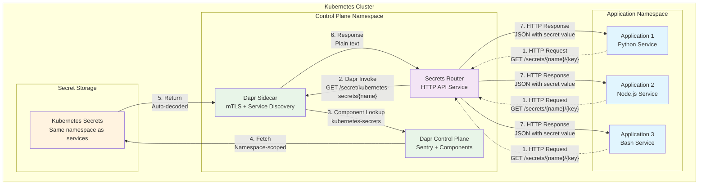

# Kubernetes Secrets Broker

A Dapr-based secrets broker service that provides a simple HTTP API for applications to fetch secrets from Kubernetes Secrets within the same namespace.

## Architecture Overview

The Kubernetes Secrets Broker acts as a centralized secret management layer that integrates with Dapr to provide seamless secret access for applications running in Kubernetes clusters.



## Service Flow

The Secrets Broker follows a simple 7-step flow for secret retrieval:

1. **Application Request** - Applications make HTTP requests to the Secrets Router service
2. **Dapr Invoke** - Secrets Router uses Dapr's secret management API via the sidecar
3. **Component Resolution** - Dapr uses the Kubernetes secrets component
4. **Backend Access** - Dapr fetches the secret from Kubernetes Secrets
5. **Data Return** - Kubernetes returns secret data (auto-decoded from base64)
6. **Sidecar Response** - Dapr sidecar returns the secret to Secrets Router
7. **HTTP Response** - Secrets Router returns a clean JSON response to the application

## Key Benefits

### 🔒 **Secure by Design**
- **Namespace Isolation**: All secrets are scoped to specific namespaces
- **mTLS Security**: Automatic mutual TLS via Dapr Sentry
- **No Secret Exposure**: Secrets never appear as environment variables

### 🚀 **Developer-Friendly**
- **Simple HTTP API**: Standard REST endpoints for secret access  
- **Auto-Decoding**: Kubernetes secrets automatically decoded from base64
- **Multi-Language**: Works with any HTTP-capable programming language

### ⚡ **Production-Ready**
- **High Availability**: Dapr provides resilience and failover
- **Kubernetes-Native**: Direct integration with Kubernetes Secrets API
- **Umbrella Chart**: Single Helm deployment with all dependencies

### 🔧 **Operationally Simple**
- **Zero Configuration**: Single namespace deployment works out of the box
- **Namespace Isolation**: Secrets are automatically scoped to deployment namespace
- **Health Monitoring**: Built-in health checks and readiness probes

## Quick Start

```bash
# Deploy the complete secrets broker (includes Dapr control plane)
helm upgrade secrets-broker ./charts/umbrella \
  --namespace production \
  --create-namespace

# Access secrets from any application
curl "http://secrets-router.production.svc.cluster.local:8080/secrets/database-credentials/password?namespace=production"
```

## Deployment

The Secrets Broker is deployed as an **umbrella Helm chart** that bundles:
- **Dapr Control Plane**: mTLS security, service discovery, and component management
- **Secrets Router Service**: HTTP API layer for secret access
- **Sample Services**: Optional client applications for testing and validation

```bash
# Install with default configuration
helm upgrade secrets-broker ./charts/umbrella \
  --namespace production \
  --create-namespace

# Install with custom configuration
helm upgrade secrets-broker ./charts/umbrella \
  --namespace production \
  --create-namespace \
  -f override.yaml
```

### Override Configuration

Customize your deployment by creating an `override.yaml` file:

```yaml
# Production configuration example
secrets-router:
  image:
    pullPolicy: Always  # Production setting
  secretStores:
    # Configuration for AWS Secrets Manager (optional)
    aws:
      enabled: false  # Set to true to use AWS Secrets Manager instead of Kubernetes secrets
      region: "us-east-1"  # Your AWS region
      multipleKeyValuesPerSecret: false  # true if secrets contain multiple key-value pairs

# Configure sample services with their required secrets
sample-service-python:
  secrets:
    rds-credentials: "production-db-credentials"    # Kubernetes secret name (or AWS Secrets Manager name)
    api-keys: "production-api-keys"                  # Kubernetes secret name (or AWS Secrets Manager name)

sample-service-node:
  secrets:
    rds-credentials: "production-db-credentials"
    redis-password: "redis-cluster-prod"

sample-service-bash:
  secrets:
    rds-credentials: "production-db-credentials"
    shell-password: "shell-credentials"
```

**Minimal Override Structure:**
```yaml
# For local testing with minimal configuration
secrets-router:
  image:
    pullPolicy: Never  # Use local images
  secretStores:
    aws:
      enabled: false
      region: "us-east-1"
      multipleKeyValuesPerSecret: false

sample-service-python:
  secrets:
    rds-credentials: "rds-credentials"
    api-keys: "api-keys"

sample-service-node:
  secrets:
    rds-credentials: "rds-credentials"
    redis-password: "redis-password"

sample-service-bash:
  secrets:
    rds-credentials: "rds-credentials"
    shell-password: "shell-password"
```

## Application Integration

Applications access secrets through simple HTTP requests to the Secrets Router service. Each service receives only essential environment variables:

```python
import requests
import os

def get_secret(secret_name: str, secret_key: str = "value") -> str:
    """Retrieve secret value via Secrets Router HTTP API."""
    secrets_router_url = os.getenv("SECRETS_ROUTER_URL")
    namespace = os.getenv("TEST_NAMESPACE")
    
    url = f"{secrets_router_url}/secrets/{secret_name}/{secret_key}"
    response = requests.get(url, params={"namespace": namespace})
    return response.json()["value"]

# Usage examples using secret names from umbrella chart configuration
database_password = get_secret("rds-credentials", "password")
api_key_secret = get_secret("production-api-keys")  # Kubernetes secret
```

### Environment Variables

Each service automatically receives these core environment variables:
- `SECRETS_ROUTER_URL`: URL of the secrets router service  
- `TEST_NAMESPACE`: Kubernetes namespace where secrets are stored

The secret names themselves are configured in the umbrella chart values, allowing services to reference them by logical names while the secrets-router handles the backend resolution.
```

## API Reference

### Get Secret

Retrieve a specific secret value from any configured backend.

```
GET /secrets/{secret_name}/{secret_key}?namespace={namespace}
```

**Parameters:**
- `secret_name` (path, required): Name or path of the secret
- `secret_key` (path, required): Key within the secret 
- `namespace` (query, required): Kubernetes namespace where the secret is stored

**Response:**
```json
{
  "backend": "kubernetes-secrets",
  "secret_name": "database-credentials", 
  "secret_key": "password",
  "value": "mypassword123"
}
```

### Health Checks

Monitor service health and readiness.

```
GET /healthz  # Liveness probe
GET /readyz   # Readiness probe
```

**Health Check Responses:**

**Liveness** (HTTP 200 when service is running):
```json
{
  "status": "healthy",
  "service": "secrets-router",
  "version": "1.0.0"
}
```

**Readiness** (HTTP 200 when Dapr is connected, HTTP 503 otherwise):
```json
{
  "status": "ready",
  "service": "secrets-router",
  "dapr_sidecar": "connected",
  "version": "1.0.0"
}
```

## Secret Access Patterns

The Secrets Router only supports same-namespace deployments for simplicity and security:

```bash
# Standard access (automatic)
curl "http://secrets-router:8080/secrets/db-secret/password?namespace=production"

# All secrets must be in the same namespace as the deployed services
```

## Configuration

### Umbrella Chart Structure

```
control-plane-umbrella (umbrella chart)
├── dapr (dependency)
│   └── Dapr control plane components
├── secrets-router (dependency)
│   ├── secrets-router service deployment
│   └── secrets-components.yaml (generates Dapr Component resources)
└── sample-service (dependency, optional for testing)
    ├── Python client
    ├── Node.js client
    └── Bash client
```

## Secret Backend

### Option 1: Kubernetes Secrets (Default)
- **Location**: Same namespace as your application and Secrets Router
- **Format**: Standard Kubernetes secret objects
- **Auto-Decoding**: Yes (base64 → plain text)
- **Namespace Isolation**: Secrets are scoped to single namespace deployment
- **Simplicity**: No additional configuration required

### Option 2: AWS Secrets Manager
You can also use AWS Secrets Manager as your secret backend instead of Kubernetes secrets.

**Prerequisites:**
- AWS IAM Roles for Service Accounts (IRSA) or alternative pod identity mechanism
- AWS Secrets Manager access permissions for the pod identity
- AWS region where your secrets are stored

**Setup Steps:**

1. **Create IAM Policy for Secrets Manager Access:**
   ```bash
   aws iam create-policy \
     --policy-name SecretsManagerReadPolicy \
     --policy-document '{
       "Version": "2012-10-17",
       "Statement": [
         {
           "Effect": "Allow",
           "Action": [
             "secretsmanager:GetSecretValue",
             "secretsmanager:DescribeSecret"
           ],
           "Resource": "arn:aws:secretsmanager:*:*:secret:*"
         }
       ]
     }'
   ```

2. **Create IAM Service Account and Attach Policy:**
   ```bash
   eksctl create iamserviceaccount \
     --cluster my-cluster \
     --namespace production \
     --name secrets-router \
     --attach-policy-arn arn:aws:iam::ACCOUNT:policy/SecretsManagerReadPolicy \
     --approve \
     --override-existing-serviceaccounts
   ```

3. **Configure secrets-router for AWS:**
   ```yaml
   # In your override.yaml
   secrets-router:
     secretStores:
       aws:
         enabled: true
         region: "us-east-1"  # Your AWS region
         multipleKeyValuesPerSecret: false  # true if secrets contain multiple key-value pairs
   ```

4. **Update Service Configuration to Use AWS Secrets Manager:**
   ```yaml
   sample-service-python:
     secrets:
       rds-credentials: "prod/db-credentials"  # AWS Secrets Manager name/path
       api-keys: "prod/api-keys"
   ```

**Key Differences:**
- **Secret Names**: Use AWS Secrets Manager secret names/paths instead of Kubernetes secret names
- **Pod Identity**: Required for authentication (IRSA recommended)
- **Region Configuration**: Must specify AWS region where secrets are stored
- **Multi-value Secrets**: Set `multipleKeyValuesPerSecret: true` if your AWS secrets contain multiple key-value pairs

## Documentation

- **[Developer Guide](./DEVELOPER.md)**: How to consume secrets in your applications
- **[Architecture](./ARCHITECTURE.md)**: Architecture diagrams and design decisions  
- **[ADR](./ADR.md)**: Architecture Decision Record
- **[Testing Workflow](./TESTING_WORKFLOW.md)**: Comprehensive testing procedures

## Project Structure

```
k8s-secrets-broker/
├── charts/
│   ├── umbrella/          # Umbrella chart (Dapr + Secrets Router + Sample Service)
│   ├── secrets-router/    # Secrets Router service chart
│   └── sample-service/    # Sample client applications chart
├── secrets-router/        # Python service implementation
├── containers/            # Sample client Dockerfiles
├── testing/               # Test scenarios and override files
├── scripts/                # Build and deployment scripts
└── docs/                   # Documentation
```

## License

See [LICENSE](./LICENSE) file.
