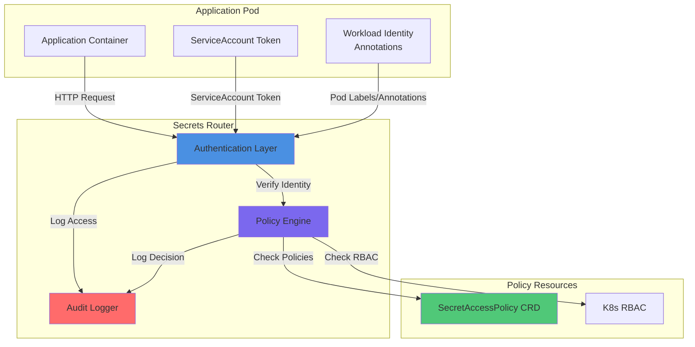
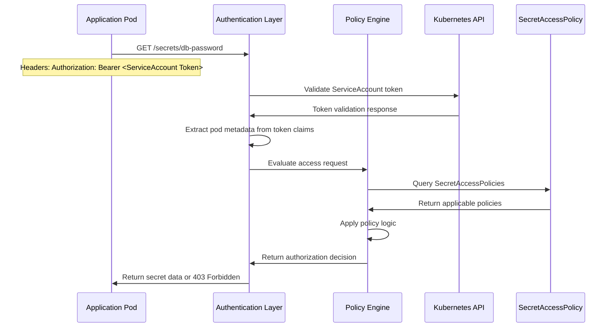
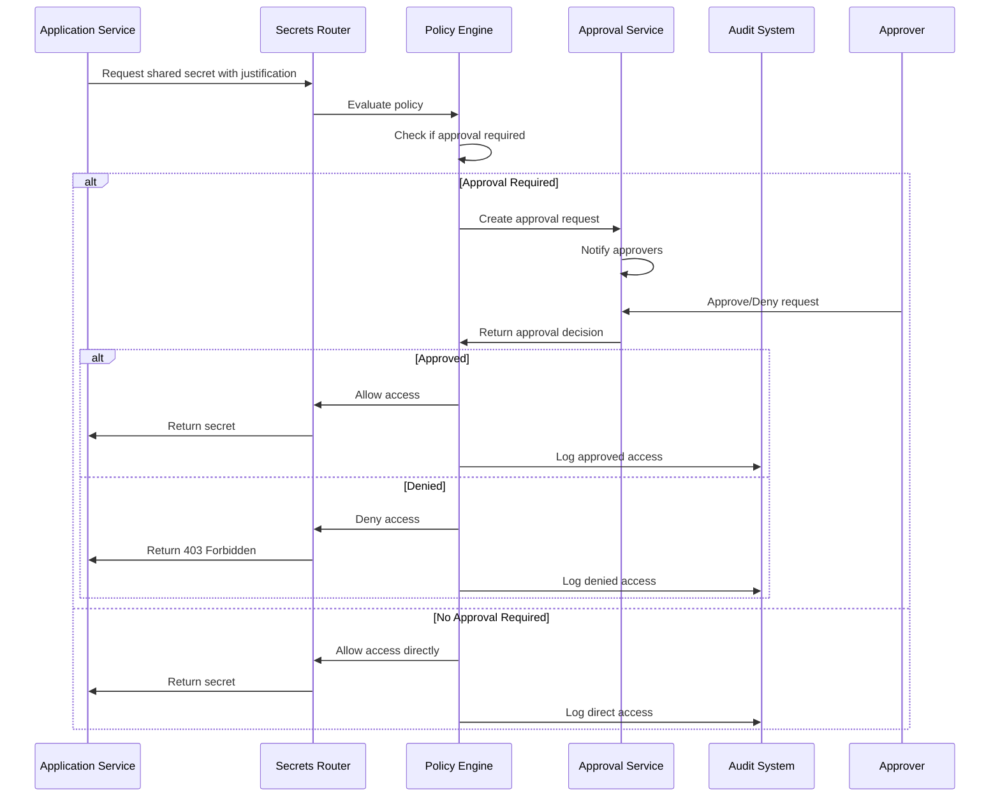
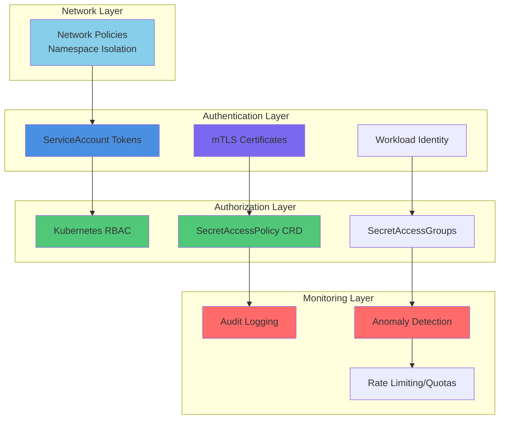

# ADR-005: Zero-Trust Service-Specific Secrets Access Architecture

## Status
**Proposed** | Date: 2025-12-02 | Authors: Platform Engineering Team

## Context

The current k8s-secrets-broker architecture provides centralized secret access through a Dapr-based service but lacks service-specific access controls. This creates significant security risks:

**Current Security Gaps:**
1. **Namespace-Level Access Only**: All services within a namespace can access all secrets in that namespace
2. **No Service Identity**: No mechanism to differentiate between different services accessing secrets
3. **Shared Secret Exposure**: Shared secrets like `rds-credentials` are accessible to any service in the namespace
4. **Insufficient Audit Trail**: Current logging doesn't capture which specific service accessed secrets
5. **Potential Lateral Movement**: Compromised service can access all secrets in the namespace
6. **No Principle of Least Privilege**: Services have broader access than required

**Business Requirements:**
1. **Zero-Trust Architecture**: Implement "never trust, always verify" principles
2. **Service-Specific Boundaries**: Each service should only access required secrets
3. **Shared Secret Management**: Support for shared resources like database credentials with proper controls
4. **Compliance Requirements**: Meet industry standards for secret access and audit
5. **Operational Simplicity**: Maintain existing developer experience while adding security

## Decision Drivers

1. **Security Posture**: Implement zero-trust principles to prevent credential theft and lateral movement
2. **Compliance**: Meet security standards (PCI, SOC2, HIPAA) for access control and audit
3. **Maintainability**: Solution must be manageable at scale without excessive operational overhead
4. **Developer Experience**: Should not significantly complicate legitimate secret access
5. **Backwards Compatibility**: Existing applications should continue to work with minimal changes
6. **Flexibility**: Support both namespace-scoped and cluster-wide secret access patterns

## Proposed Architecture

### 1. Service Identity Framework

#### Enhanced Authentication Model


#### Service Identity Sources
1. **Primary**: Kubernetes ServiceAccount token (JWT)
2. **Secondary**: Pod labels and annotations
   - `app.kubernetes.io/name`: Service name
   - `app.kubernetes.io/component`: Component identifier
   - `secrets.broker/identity`: Additional identity context
3. **Tertiary**: mTLS certificate subject (from Dapr)

#### Authentication Flow


### 2. Policy-Based Access Control

#### SecretAccessPolicy CRD
```yaml
apiVersion: secrets.broker/v1alpha1
kind: SecretAccessPolicy
metadata:
  name: frontend-db-access
  namespace: production
spec:
  # Service selector (which services this policy applies to)
  services:
    matchLabels:
      app.kubernetes.io/name: frontend
      app.kubernetes.io/component: web
  
  # Secret access rules
  rules:
    - action: "allow"
      secrets:
        - name: "database-credentials"
          keys: ["username", "password"]
          namespaces: ["production"]
    - action: "deny"
      secrets:
        - name: "admin-credentials"
          namespaces: ["*"]
    - action: "allow"
      secretGroups:
        - name: "shared-secrets"
          secrets: ["rds-credentials"]
          conditions:
            - type: "time-based"
              window: "09:00-17:00"
            - type: "approval-required"
              approver: "platform-team"
  
  # Policy conditions and constraints
  conditions:
    - type: "rate-limit"
      value: "100/minute"
    - type: "audit-level"
      value: "high"
  
  # Policy metadata
  priority: 100
  description: "Frontend service database access with audit"
```

#### Policy Evaluation Hierarchy
1. **Deny Policies**: Always take precedence (blacklist)
2. **Explicit Allow Policies**: Service-specific permissions
3. **Inherited Policies**: Namespace or cluster-wide defaults
4. **Default Deny**: If no policy matches, deny access

#### Policy Engine Architecture
```python
# Core policy evaluation logic
class PolicyEngine:
    def evaluate_access(self, request):
        # 1. Extract service identity
        service_id = self.extract_service_identity(request)
        
        # 2. Gather applicable policies
        policies = self.get_policies_for_service(service_id)
        
        # 3. Check for explicit deny rules first
        for policy in policies:
            if self.matches_deny_rule(policy, request):
                return AuthorizationResult.DENY, "Explicit deny policy"
        
        # 4. Check for explicit allow rules
        for policy in policies:
            if self.matches_allow_rule(policy, request):
                # Check additional conditions
                if self.check_conditions(policy.conditions, request):
                    return AuthorizationResult.ALLOW, "Explicit allow policy"
        
        # 5. Default deny
        return AuthorizationResult.DENY, "No matching allow policy"
```

### 3. Shared Secrets Management

#### Secret Access Groups
```yaml
apiVersion: secrets.broker/v1alpha1
kind: SecretAccessGroup
metadata:
  name: database-access
  namespace: production
spec:
  description: "Shared database credentials for production services"
  
  # Group members (services)
  members:
    - serviceSelector:
        matchLabels:
          app.kubernetes.io/name: frontend
    - serviceSelector:
        matchLabels:
          app.kubernetes.io/name: backend
    - serviceSelector:
        matchLabels:
          app.kubernetes.io/name: worker
  
  # Accessible secrets
  secrets:
    - name: "rds-credentials"
      keys: ["endpoint", "username", "password"]
      namespace: "production"
  
  # Access controls
  accessRules:
    - type: "approval-required"
      approvers: ["platform-team", "database-team"]
      timeout: "24h"
    - type: "audit-enhanced"
      logLevel: "high"
      retention: "2y"
    - type: "quota"
      requests: 1000
      period: "1d"
  
  # Justification requirements
  justificationRequired: true
  justificationTemplate: |
    Service: {{.serviceName}}
    Environment: {{.namespace}}
    Purpose: {{.purpose}}
    Duration: {{.duration}}
    Approval: {{.approverSignature}}
```

#### Just-in-Time Access Approval


### 4. Enhanced Security Controls

#### Multi-Layer Security Model


#### Security Controls Implementation
1. **Service-Specific Rate Limiting**
   ```python
   class RateLimiter:
       def check_rate_limit(self, service_id, secret_name):
           # Check per-service rate limits
           if self.exceeds_service_limit(service_id):
               return False, "Service rate limit exceeded"
           
           # Check per-secret rate limits
           if self.exceeds_secret_limit(secret_name):
               return False, "Secret access rate limit exceeded"
           
           return True, "Allowed"
   ```

2. **Anomaly Detection**
   ```python
   class AnomalyDetector:
       def detect_anomalies(self, access_request):
           anomalies = []
           
           # Unusual time access
           if self.is_unusual_time(access_request):
               anomalies.append("Unusual access time")
           
           # Unusual service behavior
           if self.is_unusual_service_pattern(access_request):
               anomalies.append("Unusual service access pattern")
           
           # New secret access
           if self.is_first_time_access(access_request):
               anomalies.append("First-time secret access")
           
           return anomalies
   ```

3. **Comprehensive Audit Logging**
   ```json
   {
     "timestamp": "2025-12-02T10:30:00Z",
     "service": {
       "name": "frontend",
       "namespace": "production",
       "serviceAccount": "frontend-sa",
       "pod": "frontend-7d4f8c9b-xyz123",
       "ip": "10.1.2.45"
     },
     "request": {
       "secret": "rds-credentials",
       "key": "password",
       "method": "GET",
       "path": "/secrets/rds-credentials/password",
       "headers": {
         "user-agent": "my-app/1.0",
         "x-request-id": "req-12345"
       }
     },
     "authorization": {
       "decision": "allow",
       "policy": "database-access-group",
       "reason": "Approved access via shared secret group",
       "approval_id": "approval-789",
       "approver": "platform-team"
     },
     "backend": {
       "type": "kubernetes-secrets",
       "duration_ms": 45,
       "namespace": "production"
     },
     "anomalies": [],
     "risk_score": 2
   }
   ```

## Implementation Plan

### Phase 1: Foundation (Weeks 1-3)
**Week 1: Policy Framework**
- Design and implement SecretAccessPolicy CRD
- Create policy engine core logic
- Install custom resource definitions
- Implement basic authentication enhancement

**Week 2: Service Identity Integration**
- Enhance authentication middleware
- Extract service identity from ServiceAccount tokens
- Implement pod metadata extraction
- Add service identity to audit logs

**Week 3: Policy Evaluation Engine**
- Complete policy evaluation hierarchy
- Implement deny/precedence rules
- Add policy condition checking
- Create initial test policies

### Phase 2: Shared Secrets Management (Weeks 4-5)
**Week 4: Secret Access Groups**
- Design and implement SecretAccessGroup CRD
- Create group membership management
- Implement shared secret access logic
- Add group-based authorization

**Week 5: Approval Workflow**
- Implement just-in-time approval system
- Create approval service integration
- Add approval status tracking
- Implement approval timeout handling

### Phase 3: Security Enhancements (Weeks 6-7)
**Week 6: Monitoring and Controls**
- Implement rate limiting and quotas
- Add anomaly detection algorithms
- Create enhanced audit logging
- Add comprehensive metrics

**Week 7: Integration and Testing**
- Complete integration with existing Dapr architecture
- Comprehensive security testing
- Performance optimization
- Documentation and runbooks

### Phase 4: Migration and GA (Weeks 8-10)
**Week 8: Migration Tools**
- Create migration scripts from current setup
- Implement backwards compatibility mode
- Add gradual rollout support
- Create configuration validation tools

**Week 9: Production Readiness**
- Security review and penetration testing
- Load testing and performance validation
- Create monitoring dashboards
- Operator training and documentation

**Week 10: General Availability**
- Production deployment
- Gradual customer migration
- Feedback collection and iteration
- Post-launch monitoring and support

## Configuration Examples

### Service-Specific Policy Example
```yaml
# Frontend service policy - minimal access
apiVersion: secrets.broker/v1alpha1
kind: SecretAccessPolicy
metadata:
  name: frontend-web-access
  namespace: production
spec:
  services:
    matchLabels:
      app.kubernetes.io/name: frontend
      app.kubernetes.io/component: web
  rules:
    - action: "allow"
      secrets:
        - name: "frontend-config"
          keys: ["api-endpoint", "ui-settings"]
        - name: "cdn-credentials"
          keys: ["access-key"]
    - action: "deny"
      secrets:
        - name: "database-credentials"  # No direct DB access
    - action: "allow"
      secretGroups:
        - name: "ui-assets"
          secrets: ["cdn-credentials"]

---

# Backend service policy - database access
apiVersion: secrets.broker/v1alpha1
kind: SecretAccessPolicy
metadata:
  name: backend-api-access
  namespace: production
spec:
  services:
    matchLabels:
      app.kubernetes.io/name: backend
      app.kubernetes.io/component: api
  rules:
    - action: "allow"
      secrets:
        - name: "database-credentials"
          keys: ["username", "password", "endpoint"]
        - name: "redis-credentials"
          keys: ["password", "host"]
        - name: "api-keys"
          keys: ["internal-api-key"]
    - action: "allow"
      secretGroups:
        - name: "shared-database"
          secrets: ["rds-credentials"]
    - action: "deny"
      secrets:
        - name: "admin-credentials"
        - name: "root-access"
```

### Migration Strategy
```yaml
# Legacy compatibility mode for gradual migration
apiVersion: secrets.broker/v1alpha1
kind: SecretAccessPolicy
metadata:
  name: legacy-compatibility
  namespace: production
spec:
  services:
    matchLabels:
      secrets.broker/mode: "legacy"
  rules:
    - action: "allow"
      secrets:
        - name: "*"  # All secrets (existing behavior)
        namespaces: ["production"]
  conditions:
    - type: "compliance-mode"
      value: "warn-only"  # Log warnings, don't block
  transitionPeriod: "30d"  # Allow 30 days for migration
  description: "Legacy compatibility policy for gradual migration"
```

## Security Benefits

1. **Zero-Trust Principle**: Every service access is explicitly authorized
2. **Principle of Least Privilege**: Services only access required secrets
3. **Lateral Movement Prevention**: Compromised service has limited secret access
4. **Enhanced Audit Trail**: Complete visibility into which services accessed which secrets
5. **Shared Secret Control**: Managed access to shared resources with approval workflow
6. **Anomaly Detection**: Automated detection of unusual access patterns
7. **Compliance Support**: Meets stringent security and compliance requirements

## Operational Considerations

### Policy Management
- **GitOps Integration**: Store policies in git for version control
- **Policy Validation**: Pre-deployment validation for policy conflicts
- **Policy Review Process**: Required review for policy changes
- **Policy Auditing**: Track all policy changes and impacts

### Monitoring and Alerting
- **Access Anomalies**: Alert on unusual secret access patterns
- **Policy Violations**: Alert on denied access attempts
- **Approval Workflows**: Alert on pending approval requests
- **Performance Monitoring**: Track policy evaluation latency

### Disaster Recovery
- **Policy Backup**: Regular backup of policy configurations
- **Fail-Safe Mechanisms**: Emergency bypass procedures
- **Recovery Testing**: Regular disaster recovery testing
- **Documentation**: Comprehensive runbooks for critical scenarios

## Backwards Compatibility

### Migration Phases
1. **Phase 1**: Install new components, disable enforcement (log-only mode)
2. **Phase 2**: Enable audit warnings for policy violations
3. **Phase 3**: Gradually enable enforcement per namespace
4. **Phase 4**: Full enforcement across all namespaces

### Compatibility Features
- **Legacy Mode**: Support for existing applications during migration
- **Gradual Rollout**: Namespace-by-namespace enforcement enablement
- **Policy Templates**: Pre-built templates for common access patterns
- **Migration Tools**: Automated policy generation from existing RBAC rules

## Risk Mitigation

### Technical Risks
- **Performance Impact**: Policy evaluation latency mitigation through caching
- **Configuration Complexity**: Policy validation and template systems
- **Service Disruption**: Gradual rollout and rollback procedures

### Security Risks
- **Policy Misconfiguration**: Automated validation and review processes
- **Privilege Escalation**: Strict policy hierarchy and approval workflows
- **Audit Log Tampering**: Immutable audit logs and external storage

### Operational Risks
- **Team Training**: Comprehensive documentation and training programs
- **Change Management**: Formal change control processes
- **Monitoring Gaps**: Enhanced observability and alerting systems

## Success Metrics

### Security Metrics
- **Reduction in Blast Radius**: Measure of lateral movement risk reduction
- **Policy Coverage**: Percentage of services with explicit policies
- **Anomaly Detection**: Number of security incidents detected early

### Operational Metrics
- **Migration Progress**: Percentage of services migrated to zero-trust model
- **Policy Complexity**: Average number of policies per service
- **Approval Workflow**: Time for shared secret access approvals

### Developer Experience Metrics
- **Onboarding Time**: Time for new services to get secret access
- **Documentation Quality**: Developer satisfaction with documentation
- **Support Requests**: Number of secret access related support tickets

## Conclusion

The Zero-Trust Service-Specific Secrets Access Architecture provides comprehensive security controls while maintaining operational simplicity and developer experience. By implementing service identity, policy-based access control, and shared secret management, we can significantly improve the security posture of the k8s-secrets-broker while supporting both service-specific and shared secret access patterns.

The phased implementation approach ensures minimal disruption to existing services while gradually introducing zero-trust principles. The backwards compatibility features and migration tools enable smooth transition from the current architecture to the enhanced security model.

This architecture addresses the critical security gaps identified in the current system while providing a foundation for future security enhancements and compliance requirements.

---

## References

- [NIST Zero Trust Architecture](https://www.nist.gov/publications/zero-trust-architecture)
- [Kubernetes ServiceAccount Tokens](https://kubernetes.io/docs/reference/access-authn-authz/service-accounts-admin/)
- [Pod Security Standards](https://kubernetes.io/docs/concepts/security/pod-security-standards/)
- [OWASP Secrets Management Cheat Sheet](https://cheatsheetseries.owasp.org/cheatsheets/Secrets_Management_Cheat_Sheet.html)
- [Current k8s-secrets-broker Architecture](./ARCHITECTURE.md)
