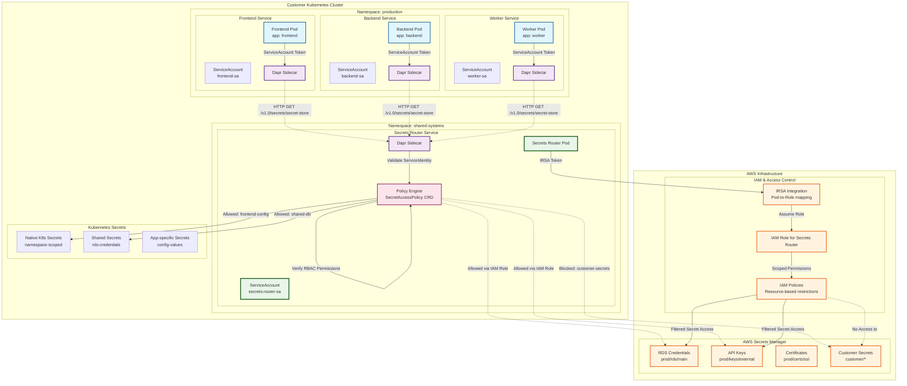
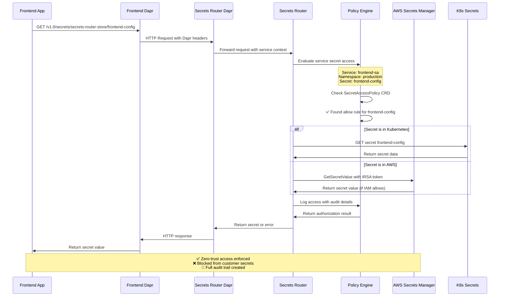
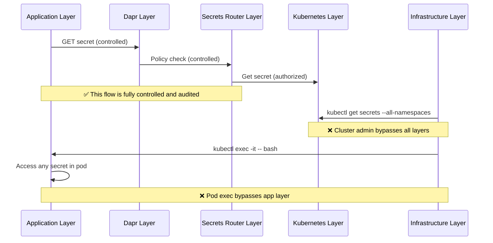
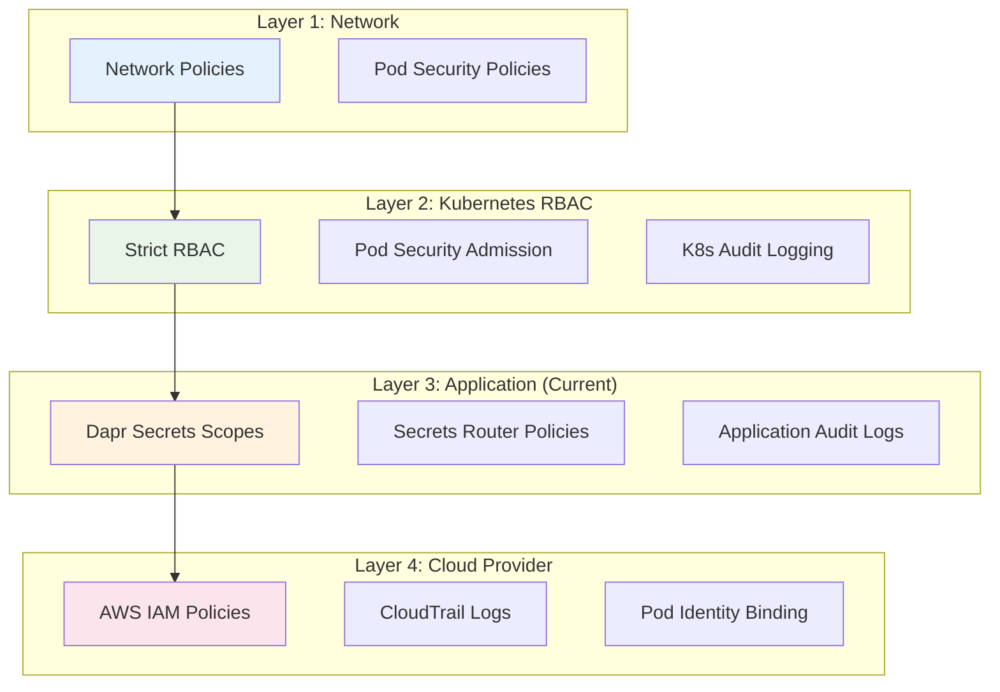
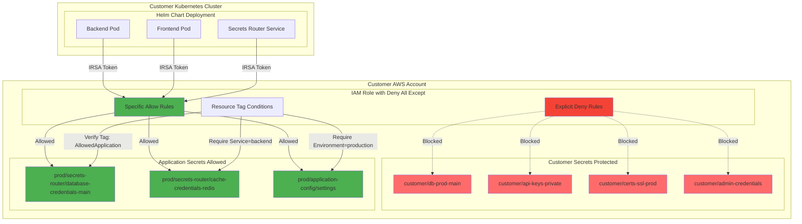

# Dapr Secrets Router Integration with AWS Secrets Manager

## Overview

This diagram illustrates how the k8s-secrets-broker integrates with Dapr secrets scopes to provide zero-trust, service-specific access to secrets from multiple backends including AWS Secrets Manager and Kubernetes native secrets.

## Architecture Diagram



## Dapr Configuration Examples

### Dapr Secrets Scopes Configuration

```yaml
# secrets-router-dapr.yaml
apiVersion: dapr.io/v1alpha1
kind: Configuration
metadata:
  name: secrets-router-config
  namespace: shared-systems
spec:
  secrets:
    scopes:
      - storeName: secrets-router-store
        defaultAccess: deny  # Zero-trust default
        allowedSecrets: []   # Explicit deny all
        deniedSecrets: ["*"] # Block everything by default
---
# Frontend service Dapr configuration
apiVersion: dapr.io/v1alpha1
kind: Configuration
metadata:
  name: frontend-config
  namespace: production
spec:
  secrets:
    scopes:
      - storeName: secrets-router-store
        defaultAccess: deny
        allowedSecrets: ["frontend-config", "cdn-credentials"]
        deniedSecrets: ["database-credentials", "admin-keys"]
---
# Backend service Dapr configuration  
apiVersion: dapr.io/v1alpha1
kind: Configuration
metadata:
  name: backend-config
  namespace: production
spec:
  secrets:
    scopes:
      - storeName: secrets-router-store
        defaultAccess: deny
        allowedSecrets: ["database-credentials", "redis-credentials"]
        deniedSecrets: ["frontend-config"]
```

### Secrets Router Kubernetes Component

```yaml
# secrets-router-component.yaml
apiVersion: dapr.io/v1alpha1
kind: Component
metadata:
  name: secrets-router-store
  namespace: shared-systems
spec:
  type: secretstores.http.secretstore
  version: v1
  metadata:
    - name: url
      value: "http://secrets-router-service.shared-systems.svc.cluster.local:8080"
    - name: headers
      value: |
        {
          "X-Dapr-App-ID": "secrets-router",
          "Authorization": "Bearer ${SECRETS_ROUTER_TOKEN}"
        }
    - name: timeout
      value: "30s"
    - name: retryCount  
      value: "3"
auth:
  secretStore: kubernetes
scopes:
  - frontend
  - backend  
  - worker
```

## Service-Specific Access Control Flow



## AWS Secrets Manager Integration Controls

### IAM Policy for Secrets Router

```json
{
  "Version": "2012-10-17",
  "Statement": [
    {
      "Effect": "Allow",
      "Action": [
        "secretsmanager:GetSecretValue",
        "secretsmanager:DescribeSecret"
      ],
      "Resource": [
        "arn:aws:secretsmanager:us-east-1:123456789012:secret:prod/rds/*",
        "arn:aws:secretsmanager:us-east-1:123456789012:secret:prod/keys/*",
        "arn:aws:secretsmanager:us-east-1:123456789012:secret:prod/certs/*"
      ],
      "Condition": {
        "StringEquals": {
          "aws:RequestedRegion": "us-east-1"
        },
        "ForAllValues:StringEquals": {
          "secretsmanager:VersionStage": "AWSCURRENT"
        }
      }
    },
    {
      "Effect": "Deny",
      "Action": [
        "secretsmanager:GetSecretValue",
        "secretsmanager:DescribeSecret"
      ],
      "Resource": [
        "arn:aws:secretsmanager:us-east-1:123456789012:secret:customer/*",
        "arn:aws:secretsmanager:us-east-1:123456789012:secret:*-admin-*",
        "arn:aws:secretsmanager:us-east-1:123456789012:secret:*-root-*"
      ]
    }
  ]
}
```

### IRSA ServiceAccount Configuration

```yaml
# secrets-router-sa.yaml
apiVersion: v1
kind: ServiceAccount
metadata:
  name: secrets-router-sa
  namespace: shared-systems
  annotations:
    # IAM Role that trusts this service account
    eks.amazonaws.com/role-arn: arn:aws:iam::123456789012:role/secrets-router-role
---
apiVersion: apps/v1
kind: Deployment
metadata:
  name: secrets-router
  namespace: shared-systems
spec:
  template:
    spec:
      serviceAccountName: secrets-router-sa
      containers:
      - name: secrets-router
        image: secrets-router:latest
        env:
        - name: AWS_REGION
          value: "us-east-1"
        - name: SECRET_BACKENDS
          value: "kubernetes,aws-secrets-manager"
```

## SecretAccessPolicy for AWS Integration

```yaml
# Example: Backend service AWS database access
apiVersion: secrets.broker/v1alpha1
kind: SecretAccessPolicy
metadata:
  name: backend-aws-db-access
  namespace: production
spec:
  services:
    matchLabels:
      app.kubernetes.io/name: backend
      app.kubernetes.io/component: api
  rules:
    - action: "allow"
      secrets:
        - backend: "aws-secrets-manager"
          name: "prod/rds/application-db"
          keys: ["username", "password", "endpoint"]
        - backend: "kubernetes"
          name: "redis-credentials"
          namespace: "production"
    - action: "deny"
      secrets:
        - backend: "aws-secrets-manager"
          name: "customer/*"
        - backend: "aws-secrets-manager"
          name: "*-admin-*"
  conditions:
    - type: "rate-limit"
      value: "100/minute"
    - type: "audit-level"
      value: "high"
  description: "Backend service database access with AWS integration"

---

# Example: Frontend service limited access
apiVersion: secrets.broker/v1alpha1
kind: SecretAccessPolicy
metadata:
  name: frontend-limited-access
  namespace: production
spec:
  services:
    matchLabels:
      app.kubernetes.io/name: frontend
      app.kubernetes.io/component: web
  rules:
    - action: "allow"
      secrets:
        - backend: "kubernetes"
          name: "frontend-config"
          namespace: "production"
        - backend: "kubernetes"
          name: "cdn-credentials"
          namespace: "production"
    - action: "deny"
      secrets:
        - backend: "aws-secrets-manager"
          name: "*"  # No AWS access for frontend
    - action: "deny"
      secrets:
        - backend: "kubernetes"
          name: "database-credentials"
  description: "Frontend service with no database or AWS access"
```

## Key Security Features

### 1. Zero-Trust Default Access
- All services start with `defaultAccess: deny`
- Explicit allow list required for each secret
- No implicit access based on namespace membership

### 2. Service Identity Verification
- ServiceAccount token-based authentication
- Pod label/annotation context
- Dapr mTLS certificate verification

### 3. Multi-Layer Authorization
1. **Dapr Scopes**: Basic secret name filtering
2. **SecretAccessPolicy CRD**: Service-specific rules
3. **IAM Policies**: AWS resource restrictions  
4. **Kubernetes RBAC**: Native permission checks

### 4. Backend-Agnostic Access Control
- Single policy interface for multiple backends
- Consistent audit logging across all secret sources
- Unified rate limiting and monitoring

### 5. Customer Secret Isolation
- Explicit IAM deny rules for customer secrets (`customer/*`)
- Namespace-level isolation for application secrets
- IRSA tokens instead of long-lived AWS credentials

### 6. Comprehensive Auditing
```json
{
  "timestamp": "2025-12-04T10:30:00Z",
  "service": {
    "name": "backend",
    "namespace": "production", 
    "serviceAccount": "backend-sa",
    "podName": "backend-7d4f8c9b-xyz123"
  },
  "request": {
    "secretStore": "secrets-router-store",
    "secret": "prod/rds/application-db",
    "backend": "aws-secrets-manager"
  },
  "authorization": {
    "decision": "allow",
    "policy": "backend-aws-db-access",
    "iamRole": "secrets-router-role",
    "allowedKeys": ["username", "password", "endpoint"]
  },
  "backend": {
    "type": "aws-secrets-manager",
    "region": "us-east-1",
    "duration_ms": 145
  }
}
```

## Benefits for Multi-Tenant Customer Deployments

1. **Customer Secret Privacy**: Customers' AWS secrets remain inaccessible to the broker
2. **Namespace Isolation**: Each customer's secrets stay within their namespaces
3. **Scoped IAM Access**: Secrets Router role has minimum necessary permissions
4. **Audit Trail**: Complete visibility into secret access patterns
5. **Gradual Migration**: Can coexist with existing secret management approaches
6. **Service-Specific Controls**: Fine-grained control per deployed service

This architecture enables zero-trust secrets management while supporting both our internal secrets and customer-provided secrets without requiring knowledge of every specific secret value.

## Limitations and Security Boundary Considerations

### Current Setup with Secrets Router

While the Secrets Router with Dapr scopes provides strong access controls, it has important limitations:

**1. Cluster-Wide Permission Bypass Risk**

```mermaid
graph TB
    subgraph "Normal Flow (Protected)"
        APP[Application Pod]
        DAPR[Dapr Sidecar]
        ROUTER[Secrets Router]
        POLICY[Policy Engine]
        SECRETS[K8s/AWS Secrets]
        
        APP -->|Secured Request| DAPR
        DAPR -->|Scoped Access| ROUTER
        ROUTER -->|Policy Check| POLICY
        POLICY -->|Authorized Access| SECRETS
    end
    
    subgraph "Bypass Flow (Risk)"
        BAD_ACTOR[Compromised Service / Cluster Admin]
        K8S_API[Kubernetes API Direct Access]
        SECRET_STORE[Direct Secret Store Access]
        ALL_SECRETS[All Secrets Accessible]
        
        BAD_ACTOR -->|Cluster-Admin Token| K8S_API
        K8S_API -->|kubectl get secrets| SECRET_STORE
        SECRET_STORE -->|No Restrictions| ALL_SECRETS
    end
    
    style BAD_ACTOR fill:#ff6b6b
    style K8S_API fill:#ff6b6b
    style SECRET_STORE fill:#ff6b6b
    style ALL_SECRETS fill:#ff6b6b
```


*Note: Cluster Admin or any permission with secrets/* access can completely bypass all security boundaries.*

**2. Namespace Override Vulnerabilities**
- Users with `cluster-admin` or namespace admin privileges can override Dapr configurations
- ServiceAccount token escalation can bypass service identity verification
- Pod creation with elevated privileges can access raw secret stores

**3. Dapr Configuration Tampering**
```yaml
# Malicious user could modify Dapr config to:
apiVersion: dapr.io/v1alpha1
kind: Configuration
metadata:
  name: compromised-config
spec:
  secrets:
    scopes:
      - storeName: kubernetes  # Bypass secrets router entirely
        defaultAccess: allow    # Direct access to K8s secrets
        allowedSecrets: ["*"]  # All secrets accessible
```

### Setup Without Secrets Router

Removing the Secrets Router actually **increases** these security risks:

**1. Direct K8s Secrets Access**

```mermaid
graph TB
    subgraph "No Secrets Router - Direct Access"
        PODO[Pod with privileged ServiceAccount]
        K8S_API2[Direct K8s API Access]
        NATIVE_SECRETS[All K8s Secrets in Namespace]
        
        PODO -->|kubectl/Client Libraries| K8S_API2
        K8S_API2 -.->|No Middleware| NATIVE_SECRETS
    end
    
    subgraph "No Secrets Router - No Dapr"
        APP2[Application Code]
        SDK[AWS SDK / Other Clients]
        CLOUD_CREDS[IAM Role / Cloud Credentials]
        CLOUD_SECRETS[All Cloud Secrets]
        
        APP2 -->|Direct AWS API calls| SDK
        SDK -->|Pod IRSA tokens| CLOUD_CREDS
        CLOUD_CREDS -->|Full permissions| CLOUD_SECRETS
    end
    
    style PODO fill:#ff6b6b
    style K8S_API2 fill:#ff6b6b
    style NATIVE_SECRETS fill:#ff6b6b
    style APP2 fill:#ffa500
    style SDK fill:#ffa500
    style CLOUD_SECRETS fill:#ffa500
```


*Note: Direct access bypasses all security controls, providing no audit trail, rate limiting, or service-specific policies.*

**2. Loss of Security Benefits**
| Security Feature | With Secrets Router | Without Secrets Router |
|------------------|-------------------|---------------------|
| Service Identity Enforcement | ✅ Yes | ❌ No |
| Audit Logging | ✅ Comprehensive | ❌ Minimal/None |
| Rate Limiting | ✅ Per-service | ❌ None |
| Policy-Based Access | ✅ Fine-grained | ❌ Namespace/RBAC only |
| Secret Access Anomaly Detection | ✅ Yes | ❌ No |
| Multi-Backend Unification | ✅ Yes | ❌ Separate clients required |

### Security Boundary Analysis

**The Fundamental Limitation**

Dapr and Secrets Router provide **application-layer** security boundaries, but they cannot prevent bypass by users with **infrastructure-layer** permissions:



### Recommended Security Enhancements

**1. Defense in Depth Approach**


**2. Mitigation Strategies**

| Risk Level | Threat Vector | Mitigation |
|------------|---------------|------------|
| **Critical** | Cluster Admin compromise | - Multi-person approval for cluster-admin<br>- Break-glass access procedures<br>- Regular access reviews |
| **High** | Namespace admin escalation | - Namespace quotas and limits<br>- OPA/Gatekeeper policies<br>- ServiceAccount token restrictions |
| **Medium** | Pod/ServiceAccount compromise | - Pod Security Standards enforcement<br>- Node isolation<br>- Runtime security monitoring |
| **Low** | Application-level bypass | - Secrets Router policies<br>- Dapr scopes validation<br>- Application secrets encryption |

**3. Operational Recommendations**

1. **Least Privilege Infrastructure Access**
   - Use role-based access instead of cluster-admin where possible
   - Implement just-in-time access requests for elevated permissions
   - Regular audit of who has cluster-wide permissions

2. **Detect and Alert on Bypass Attempts**
   ```yaml
   # Example Falco rule for suspicious secret access
   - rule: Unauthorized Secret Access
     condition: >
       kubectl and
       (k8s.ns.name != "kube-system") and
       (k8s.secrets.name != "default-token-*") and
       user.name != "system:serviceaccount:secrets-router:secrets-router-sa"
     output: >
       Unauthorized secret access detected (user=%user.name ns=%k8s.ns.name 
       secret=%k8s.secrets.name pod=%k8s.pod.name)
     priority: HIGH
   ```

3. **Secrets Configuration Validation**
   - GitOps-based policy management
   - Automated policy conflict detection  
   - Compliance scanning for secret access patterns

### Conclusion

While Dapr secrets scopes and the Secrets Router provide strong **application-layer** security controls, they cannot prevent bypass by users with **infrastructure-level** permissions. The most secure approach combines:

1. **Kubernetes-native controls** (RBAC, PSP, Network Policies)
2. **Application-layer controls** (Dapr scopes, Secrets Router policies)  
3. **Infrastructure governance** (Access reviews, break-glass procedures)
4. **Comprehensive monitoring** (Audit logs, anomaly detection)

The Secrets Router significantly raises the bar for secure secret access and provides essential auditing and policy enforcement that's missing from vanilla Kubernetes, but it should be part of a comprehensive defense-in-depth strategy rather than the sole security boundary.

## Customer Secret Protection - Deny All Except Specific Applications

### Customer Use Case

When a customer wants to protect their secrets in AWS Secrets Manager while allowing our helm chart to access only specific application secrets, we need a **deny-all-except** IAM policy approach.

### Customer-Specific IAM Policy Template

```json
{
  "Version": "2012-10-17",
  "Statement": [
    {
      "Effect": "Deny",
      "Action": [
        "secretsmanager:GetSecretValue",
        "secretsmanager:DescribeSecret",
        "secretsmanager:ListSecrets"
      ],
      "Resource": [
        "arn:aws:secretsmanager:${AWS_REGION}:${AWS_ACCOUNT_ID}:secret:customer/*",
        "arn:aws:secretsmanager:${AWS_REGION}:${AWS_ACCOUNT_ID}:secret:*-admin-*",
        "arn:aws:secretsmanager:${AWS_REGION}:${AWS_ACCOUNT_ID}:secret:*-root-*",
        "arn:aws:secretsmanager:${AWS_REGION}:${AWS_ACCOUNT_ID}:secret:*-private-*"
      ]
    },
    {
      "Effect": "Allow",
      "Action": [
        "secretsmanager:GetSecretValue",
        "secretsmanager:DescribeSecret"
      ],
      "Resource": [
        "arn:aws:secretsmanager:${AWS_REGION}:${AWS_ACCOUNT_ID}:secret:prod/secrets-router-backend/*",
        "arn:aws:secretsmanager:${AWS_REGION}:${AWS_ACCOUNT_ID}:secret:prod/application-config/*",
        "arn:aws:secretsmanager:${AWS_REGION}:${AWS_ACCOUNT_ID}:secret:prod/shared/*"
      ],
      "Condition": {
        "StringEquals": {
          "aws:RequestedRegion": "${AWS_REGION}",
          "secretsmanager:ResourceTag/AllowedApplication": "secrets-router"
        },
        "ForAllValues:StringEquals": {
          "secretsmanager:VersionStage": "AWSCURRENT"
        },
        "IpAddress": {
          "aws:SourceIp": [
            "10.0.0.0/8",
            "172.16.0.0/12", 
            "192.168.0.0/16"
          ]
        }
      }
    },
    {
      "Effect": "Allow",
      "Action": [
        "secretsmanager:GetSecretValue"
      ],
      "Resource": [
        "arn:aws:secretsmanager:${AWS_REGION}:${AWS_ACCOUNT_ID}:secret:prod/database-credentials-main"
      ],
      "Condition": {
        "StringEquals": {
          "aws:RequestedRegion": "${AWS_REGION}",
          "secretsmanager:ResourceTag/Service": ["backend", "worker"],
          "secretsmanager:ResourceTag/Environment": "production"
        },
        "DateGreaterThan": {
          "aws:CurrentTime": "2025-01-01T00:00:00Z"
        },
        "StringLessThan": {
          "aws:RequestedRegion": "us-east-1"
        }
      }
    }
  ]
}
```

### Helm Chart Integration

#### Values.yaml Configuration for Customer

```yaml
# Customer-specific values.yaml
secretsRouter:
  # IAM role configuration for customer deployment
  iam:
    # Existing IAM role to use (customer provides)
    existingRoleArn: "arn:aws:iam::${CUSTOMER_ACCOUNT}:role/customer-secrets-router-role"
    
    # OR create new role with these policies
    createRole: true
    trustedServiceAccount: "secrets-router-sa"
    
    # IAM policies to attach
    policies:
      denyCustomerSecrets:
        # Deny access to customer-namespace secrets
        effect: "Deny"
        actions: ["secretsmanager:GetSecretValue"]
        resources: ["arn:aws:secretsmanager:*:${CUSTOMER_ACCOUNT}:secret:customer/*"]
        resources: ["arn:aws:secretsmanager:*:${CUSTOMER_ACCOUNT}:secret:*-private-*"]
        
      allowApplicationSecrets:
        # Allow only specific application secrets
        effect: "Allow"
        actions: ["secretsmanager:GetSecretValue"]
        resources: [
          "arn:aws:secretsmanager:*:${CUSTOMER_ACCOUNT}:secret:prod/secrets-router/*",
          "arn:aws:secretsmanager:*:${CUSTOMER_ACCOUNT}:secret:prod/app-config/*"
        ]
        conditions:
          StringEquals:
            "secretsmanager:ResourceTag/AllowedApplication": "secrets-router"

# Application configuration
applications:
  backend:
    secretAccess:
      allowedSecrets:
        - backend: "aws-secrets-manager"
          name: "prod/database-credentials-main"
          tags:
            Service: "backend"
            Environment: "production"
      deniedSecrets:
        - backend: "aws-secrets-manager"  
          name: "customer/*"
          reason: "Customer secret protection"
```

#### Helm Chart Implementation Template

```yaml
# templates/iam-policy.yaml
{{- if .Values.secretsRouter.iam.createRole }}
apiVersion: v1
kind: ConfigMap
metadata:
  name: {{ include "secrets-router.fullname" . }}-iam-policy
  labels:
    {{- include "secrets-router.labels" . | nindent 4 }}
data:
  policy.json: |-
    {
      "Version": "2012-10-17",
      "Statement": [
        {
          "Effect": "Deny",
          "Action": [
            "secretsmanager:GetSecretValue",
            "secretsmanager:DescribeSecret"
          ],
          "Resource": [
            {{- range $denyPattern := .Values.secretsRouter.iam.deniedPatterns }}
            "arn:aws:secretsmanager:*:${AWS_ACCOUNT_ID}:secret:{{ $denyPattern }}",
            {{- end }}
            "arn:aws:secretsmanager:*:${AWS_ACCOUNT_ID}:secret:customer/*"
          ]
        },
        {
          "Effect": "Allow", 
          "Action": [
            "secretsmanager:GetSecretValue",
            "secretsmanager:DescribeSecret"
          ],
          "Resource": [
            {{- range $allowedSecret := .Values.secretsRouter.iam.allowedSecrets }}
            "arn:aws:secretsmanager:*:${AWS_ACCOUNT_ID}:secret:{{ $allowedSecret }}",
            {{- end }}
          ],
          "Condition": {
            "StringEquals": {
              "aws:RequestedRegion": "{{ .Values.region }}",
              "secretsmanager:ResourceTag/AllowedApplication": "secrets-router"
            }
          }
        }
      ]
    }
---
apiVersion: rbac.authorization.k8s.io/v1
kind: ClusterRole
metadata:
  name: {{ include "secrets-router.fullname" . }}-secret-access
  labels:
    {{- include "secrets-router.labels" . | nindent 4 }}
rules:
- apiGroups: [""]
  resources: ["secrets"]
  verbs: ["get", "list"]
  resourceNames:
  {{- range $allowedSecret := .Values.kubernetesSecrets.allowed }}
  - {{ $allowedSecret }}
  {{- end }}
- apiGroups: [""]  
  resources: ["secrets"]
  verbs: []  # Explicit deny for all other secrets
  resourceNames:
  {{- range $deniedSecret := .Values.kubernetesSecrets.denied }}
  - {{ $deniedSecret }}
  {{- end }}
{{- end }}
```

### Customer-Specific SecretAccessPolicy CRDs

```yaml
# Customer application access policy
apiVersion: secrets.broker/v1alpha1
kind: SecretAccessPolicy
metadata:
  name: customer-backend-policy
  namespace: {{ .Release.Namespace }}
spec:
  services:
    matchLabels:
      app.kubernetes.io/name: backend
      app.kubernetes.io/instance: {{ .Release.Name }}
  rules:
    - action: "allow"
      secrets:
        - backend: "aws-secrets-manager"
          name: "prod/database-credentials-main"
          tags:
            Service: "backend"
            Environment: "production"
        - backend: "aws-secrets-manager"
          name: "prod/cache-credentials-redis"
          tags:
            Service: "backend"
            Environment: "production"
    - action: "deny"
      secrets:
        - backend: "aws-secrets-manager"
          name: "customer/*"
          reason: "Customer secret protection - no access allowed"
        - backend: "aws-secrets-manager"
          name: "*-admin-*"
          reason: "Admin secrets protection"
        - backend: "aws-secrets-manager"  
          name: "*-root-*"
          reason: "Root secrets protection"
    - action: "deny"
      secrets:
        - backend: "kubernetes"
          name: "customer-*"
          reason: "Customer namespace isolation"
  conditions:
    - type: "require-approval"
      value: "false"  # Auto-approved for customer-specific secrets
    - type: "audit-level" 
      value: "high"
    - type: "time-restriction"
      value: "business-hours-only"
  description: "Customer backend service with deny-all-except customer secrets"
  customerSpecific: true
```

### Deployment Diagram for Customer Protection



*Note: Customer secrets are explicitly blocked by IAM policy while only app-specific secrets are allowed through resource tag conditions.*

### Customer Implementation Steps

#### 1. Pre-Deployment Setup

```bash
# Customer creates IAM policy
aws iam create-policy \
    --policy-name SecretsRouterCustomerPolicy \
    --policy-document file://customer-deny-all-except-policy.json

# Customer creates IAM role with required trust relationship
aws iam create-role \
    --role-name customer-secrets-router-role \
    --assume-role-policy-document file://irsa-trust-policy.json

# Attach policy to role
aws iam attach-role-policy \
    --role-name customer-secrets-router-role \
    --policy-arn arn:aws:iam::${CUSTOMER_ACCOUNT}:policy/SecretsRouterCustomerPolicy
```

#### 2. Secret Tagging Requirements

```bash
# Customer tags their secrets appropriately
aws secretsmanager tag-resource \
    --secret-id "prod/secrets-router/database-credentials-main" \
    --tags Key=AllowedApplication,Value=secrets-router \
           Key=Service,Value=backend \
           Key=Environment,Value=production

# Customer secrets remain untagged or have different tags
aws secretsmanager tag-resource \
    --secret-id "customer/db-prod-main" \
    --tags Key=Owner,Value=customer-team \
           Key=Environment,Value=production \
           # ❌ No "AllowedApplication=secrets-router" tag
```

#### 3. Helm Installation

```bash
# Customer installs helm chart with their specific configuration
helm install secrets-router ./charts/secrets-router \
    --namespace production \
    --create-namespace \
    --set-file iamPolicy.iamPolicy=./customer-deny-all-except-policy.json \
    --set secretsRouter.iam.existingRoleArn=arn:aws:iam::${CUSTOMER_ACCOUNT}:role/customer-secrets-router-role \
    --set region=us-east-1 \
    --values customer-values.yaml
```

### Monitoring and Alerting for Customer Compliance

```yaml
# CloudWatch Alarm for unauthorized access attempts
Resources:
  SecretAccessDeniedAlarm:
    Type: AWS::CloudWatch::Alarm
    Properties:
      AlarmName: "SecretsRouter-AccessDenied"
      MetricName: "AccessDenied"
      Namespace: "AWS/SecretsManager"
      Statistic: "Sum"
      Period: 300
      EvaluationPeriods: 1
      Threshold: 1
      ComparisonOperator: "GreaterThanOrEqualToThreshold"
      AlarmActions:
        - arn:aws:sns:${AWS_REGION}:${AWS_ACCOUNT_ID}:SecurityAlerts
      TreatMissingData: "notBreaching"
```

### Benefits for Customers

1. **Zero-Knowledge Protection**: We (helmet chart provider) never need to know customer secret names
2. **Explicit Deny Policy**: Customer secrets are explicitly rejected, not just not-in-allow-list
3. **Tag-Based Enforcement**: Clean separation using AWS resource tagging
4. **IAM Integration**: Uses AWS native permissions, no custom IAM policies needed
5. **Audit Trail**: CloudTrail logs all access attempts (both allowed and denied)
6. **Granular Control**: Can specify exactly which application secrets are allowed

This approach gives customers complete control over their secret access while allowing our helm chart to function with only the specific secrets it requires.
