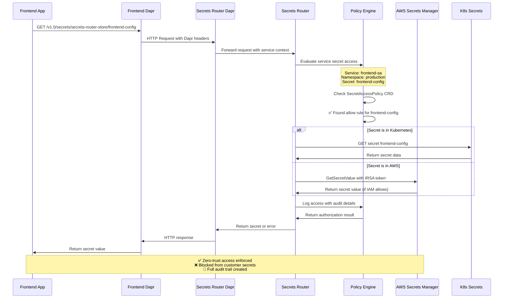

# Dapr Secrets Router Integration with AWS Secrets Manager

## Overview

This diagram illustrates how the k8s-secrets-broker integrates with Dapr secrets scopes to provide zero-trust, service-specific access to secrets from multiple backends including AWS Secrets Manager and Kubernetes native secrets.

## Architecture Diagram


## Dapr Configuration Examples

### Dapr Secrets Scopes Configuration

```yaml
# secrets-router-dapr.yaml
apiVersion: dapr.io/v1alpha1
kind: Configuration
metadata:
  name: secrets-router-config
  namespace: shared-systems
spec:
  secrets:
    scopes:
      - storeName: secrets-router-store
        defaultAccess: deny  # Zero-trust default
        allowedSecrets: []   # Explicit deny all
        deniedSecrets: ["*"] # Block everything by default
---
# Frontend service Dapr configuration
apiVersion: dapr.io/v1alpha1
kind: Configuration
metadata:
  name: frontend-config
  namespace: production
spec:
  secrets:
    scopes:
      - storeName: secrets-router-store
        defaultAccess: deny
        allowedSecrets: ["frontend-config", "cdn-credentials"]
        deniedSecrets: ["database-credentials", "admin-keys"]
---
# Backend service Dapr configuration  
apiVersion: dapr.io/v1alpha1
kind: Configuration
metadata:
  name: backend-config
  namespace: production
spec:
  secrets:
    scopes:
      - storeName: secrets-router-store
        defaultAccess: deny
        allowedSecrets: ["database-credentials", "redis-credentials"]
        deniedSecrets: ["frontend-config"]
```

### Secrets Router Kubernetes Component

```yaml
# secrets-router-component.yaml
apiVersion: dapr.io/v1alpha1
kind: Component
metadata:
  name: secrets-router-store
  namespace: shared-systems
spec:
  type: secretstores.http.secretstore
  version: v1
  metadata:
    - name: url
      value: "http://secrets-router-service.shared-systems.svc.cluster.local:8080"
    - name: headers
      value: |
        {
          "X-Dapr-App-ID": "secrets-router",
          "Authorization": "Bearer ${SECRETS_ROUTER_TOKEN}"
        }
    - name: timeout
      value: "30s"
    - name: retryCount  
      value: "3"
auth:
  secretStore: kubernetes
scopes:
  - frontend
  - backend  
  - worker
```

## Service-Specific Access Control Flow



## AWS Secrets Manager Integration Controls

### IAM Policy for Secrets Router

```json
{
  "Version": "2012-10-17",
  "Statement": [
    {
      "Effect": "Allow",
      "Action": [
        "secretsmanager:GetSecretValue",
        "secretsmanager:DescribeSecret"
      ],
      "Resource": [
        "arn:aws:secretsmanager:us-east-1:123456789012:secret:prod/rds/*",
        "arn:aws:secretsmanager:us-east-1:123456789012:secret:prod/keys/*",
        "arn:aws:secretsmanager:us-east-1:123456789012:secret:prod/certs/*"
      ],
      "Condition": {
        "StringEquals": {
          "aws:RequestedRegion": "us-east-1"
        },
        "ForAllValues:StringEquals": {
          "secretsmanager:VersionStage": "AWSCURRENT"
        }
      }
    },
    {
      "Effect": "Deny",
      "Action": [
        "secretsmanager:GetSecretValue",
        "secretsmanager:DescribeSecret"
      ],
      "Resource": [
        "arn:aws:secretsmanager:us-east-1:123456789012:secret:customer/*",
        "arn:aws:secretsmanager:us-east-1:123456789012:secret:*-admin-*",
        "arn:aws:secretsmanager:us-east-1:123456789012:secret:*-root-*"
      ]
    }
  ]
}
```

### IRSA ServiceAccount Configuration

```yaml
# secrets-router-sa.yaml
apiVersion: v1
kind: ServiceAccount
metadata:
  name: secrets-router-sa
  namespace: shared-systems
  annotations:
    # IAM Role that trusts this service account
    eks.amazonaws.com/role-arn: arn:aws:iam::123456789012:role/secrets-router-role
---
apiVersion: apps/v1
kind: Deployment
metadata:
  name: secrets-router
  namespace: shared-systems
spec:
  template:
    spec:
      serviceAccountName: secrets-router-sa
      containers:
      - name: secrets-router
        image: secrets-router:latest
        env:
        - name: AWS_REGION
          value: "us-east-1"
        - name: SECRET_BACKENDS
          value: "kubernetes,aws-secrets-manager"
```

## SecretAccessPolicy for AWS Integration

```yaml
# Example: Backend service AWS database access
apiVersion: secrets.broker/v1alpha1
kind: SecretAccessPolicy
metadata:
  name: backend-aws-db-access
  namespace: production
spec:
  services:
    matchLabels:
      app.kubernetes.io/name: backend
      app.kubernetes.io/component: api
  rules:
    - action: "allow"
      secrets:
        - backend: "aws-secrets-manager"
          name: "prod/rds/application-db"
          keys: ["username", "password", "endpoint"]
        - backend: "kubernetes"
          name: "redis-credentials"
          namespace: "production"
    - action: "deny"
      secrets:
        - backend: "aws-secrets-manager"
          name: "customer/*"
        - backend: "aws-secrets-manager"
          name: "*-admin-*"
  conditions:
    - type: "rate-limit"
      value: "100/minute"
    - type: "audit-level"
      value: "high"
  description: "Backend service database access with AWS integration"

---

# Example: Frontend service limited access
apiVersion: secrets.broker/v1alpha1
kind: SecretAccessPolicy
metadata:
  name: frontend-limited-access
  namespace: production
spec:
  services:
    matchLabels:
      app.kubernetes.io/name: frontend
      app.kubernetes.io/component: web
  rules:
    - action: "allow"
      secrets:
        - backend: "kubernetes"
          name: "frontend-config"
          namespace: "production"
        - backend: "kubernetes"
          name: "cdn-credentials"
          namespace: "production"
    - action: "deny"
      secrets:
        - backend: "aws-secrets-manager"
          name: "*"  # No AWS access for frontend
    - action: "deny"
      secrets:
        - backend: "kubernetes"
          name: "database-credentials"
  description: "Frontend service with no database or AWS access"
```

## Key Security Features

### 1. Zero-Trust Default Access
- All services start with `defaultAccess: deny`
- Explicit allow list required for each secret
- No implicit access based on namespace membership

### 2. Service Identity Verification
- ServiceAccount token-based authentication
- Pod label/annotation context
- Dapr mTLS certificate verification

### 3. Multi-Layer Authorization
1. **Dapr Scopes**: Basic secret name filtering
2. **SecretAccessPolicy CRD**: Service-specific rules
3. **IAM Policies**: AWS resource restrictions  
4. **Kubernetes RBAC**: Native permission checks

### 4. Backend-Agnostic Access Control
- Single policy interface for multiple backends
- Consistent audit logging across all secret sources
- Unified rate limiting and monitoring

### 5. Customer Secret Isolation
- Explicit IAM deny rules for customer secrets (`customer/*`)
- Namespace-level isolation for application secrets
- IRSA tokens instead of long-lived AWS credentials

### 6. Comprehensive Auditing
```json
{
  "timestamp": "2025-12-04T10:30:00Z",
  "service": {
    "name": "backend",
    "namespace": "production", 
    "serviceAccount": "backend-sa",
    "podName": "backend-7d4f8c9b-xyz123"
  },
  "request": {
    "secretStore": "secrets-router-store",
    "secret": "prod/rds/application-db",
    "backend": "aws-secrets-manager"
  },
  "authorization": {
    "decision": "allow",
    "policy": "backend-aws-db-access",
    "iamRole": "secrets-router-role",
    "allowedKeys": ["username", "password", "endpoint"]
  },
  "backend": {
    "type": "aws-secrets-manager",
    "region": "us-east-1",
    "duration_ms": 145
  }
}
```

## Benefits for Multi-Tenant Customer Deployments

1. **Customer Secret Privacy**: Customers' AWS secrets remain inaccessible to the broker
2. **Namespace Isolation**: Each customer's secrets stay within their namespaces
3. **Scoped IAM Access**: Secrets Router role has minimum necessary permissions
4. **Audit Trail**: Complete visibility into secret access patterns
5. **Gradual Migration**: Can coexist with existing secret management approaches
6. **Service-Specific Controls**: Fine-grained control per deployed service

This architecture enables zero-trust secrets management while supporting both our internal secrets and customer-provided secrets without requiring knowledge of every specific secret value.
