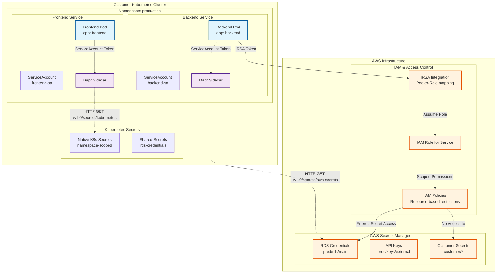
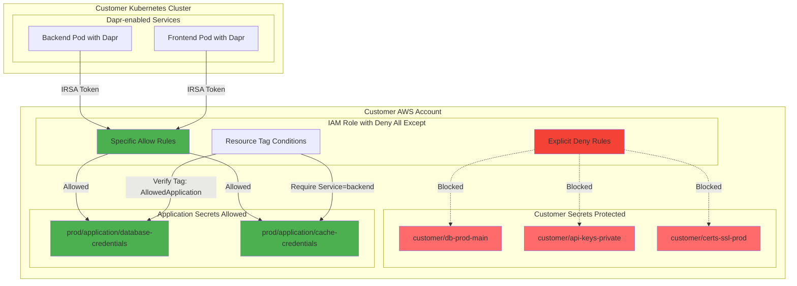

# Dapr Secrets Scopes with AWS Secrets Manager

## Overview

This document describes how Dapr secrets scopes enable zero-trust, service-specific access to secrets from multiple backends including AWS Secrets Manager and Kubernetes native secrets.

## Architecture Diagram



## Dapr Configuration Examples

### Dapr Secrets Scopes Configuration

```yaml
# kubernetes-secret-store.yaml
apiVersion: dapr.io/v1alpha1
kind: Component
metadata:
  name: kubernetes-secret-store
  namespace: production
spec:
  type: secretstores.kubernetes
  version: v1
  metadata:
  - name: "kubeConfigFile"
    value: "/tmp/kubeconfig"
scopes:
  - frontend
  - backend
  
---
# aws-secret-store.yaml  
apiVersion: dapr.io/v1alpha1
kind: Component
metadata:
  name: aws-secret-store
  namespace: production
spec:
  type: secretstores.aws.secretmanager
  version: v1
  metadata:
    - name: region
      value: "us-east-1"
    - name: accessKey
      secretKeyRef:
        name: aws-secrets
        key: accessKey
    - name: secretKey
      secretKeyRef:
        name: aws-secrets  
        key: secretKey
scopes:
  - backend

---
# frontend-dapr-config.yaml
apiVersion: dapr.io/v1alpha1
kind: Configuration
metadata:
  name: frontend-config
  namespace: production
spec:
  secrets:
    scopes:
      - storeName: kubernetes-secret-store
        defaultAccess: deny
        allowedSecrets: ["frontend-config", "cdn-credentials"]
        deniedSecrets: ["database-credentials", "admin-keys"]
      - storeName: aws-secret-store
        defaultAccess: deny  # No AWS access for frontend
        allowedSecrets: []

---
# backend-dapr-config.yaml
apiVersion: dapr.io/v1alpha1
kind: Configuration
metadata:
  name: backend-config
  namespace: production
spec:
  secrets:
    scopes:
      - storeName: kubernetes-secret-store
        defaultAccess: deny
        allowedSecrets: ["redis-credentials"]
        deniedSecrets: ["frontend-config"]
      - storeName: aws-secret-store
        defaultAccess: deny
        allowedSecrets: ["prod/rds/application-db", "prod/cache/redis"]
        deniedSecrets: ["customer/*", "*-admin-*"]
```

## AWS Secrets Manager Integration

### IRSA ServiceAccount Configuration

```yaml
# backend-service-account.yaml
apiVersion: v1
kind: ServiceAccount
metadata:
  name: backend-sa
  namespace: production
  annotations:
    # IAM Role that trusts this service account
    eks.amazonaws.com/role-arn: arn:aws:iam::123456789012:role/backend-service-role
---
apiVersion: apps/v1
kind: Deployment
metadata:
  name: backend
  namespace: production
spec:
  template:
    spec:
      serviceAccountName: backend-sa
      containers:
      - name: backend
        image: backend:latest
        env:
        - name: AWS_REGION
          value: "us-east-1"
```

### IAM Policy for Backend Service

```json
{
  "Version": "2012-10-17",
  "Statement": [
    {
      "Effect": "Allow",
      "Action": [
        "secretsmanager:GetSecretValue",
        "secretsmanager:DescribeSecret"
      ],
      "Resource": [
        "arn:aws:secretsmanager:us-east-1:123456789012:secret:prod/rds/application-db",
        "arn:aws:secretsmanager:us-east-1:123456789012:secret:prod/cache/redis"
      ],
      "Condition": {
        "StringEquals": {
          "aws:RequestedRegion": "us-east-1"
        },
        "ForAllValues:StringEquals": {
          "secretsmanager:VersionStage": "AWSCURRENT"
        }
      }
    },
    {
      "Effect": "Deny",
      "Action": [
        "secretsmanager:GetSecretValue",
        "secretsmanager:DescribeSecret"
      ],
      "Resource": [
        "arn:aws:secretsmanager:us-east-1:123456789012:secret:customer/*",
        "arn:aws:secretsmanager:us-east-1:123456789012:secret:*-admin-*",
        "arn:aws:secretsmanager:us-east-1:123456789012:secret:*-root-*"
      ]
    }
  ]
}
```

## Customer Secret Protection

### Customer Use Case

Customers want to protect their secrets in AWS Secrets Manager while allowing only specific application secrets to be accessible through deny-all-except IAM policies.

### Customer-Specific IAM Policy Template

```json
{
  "Version": "2012-10-17",
  "Statement": [
    {
      "Effect": "Deny",
      "Action": [
        "secretsmanager:GetSecretValue",
        "secretsmanager:DescribeSecret",
        "secretsmanager:ListSecrets"
      ],
      "Resource": [
        "arn:aws:secretsmanager:${AWS_REGION}:${AWS_ACCOUNT_ID}:secret:customer/*",
        "arn:aws:secretsmanager:${AWS_REGION}:${AWS_ACCOUNT_ID}:secret:*-admin-*",
        "arn:aws:secretsmanager:${AWS_REGION}:${AWS_ACCOUNT_ID}:secret:*-root-*",
        "arn:aws:secretsmanager:${AWS_REGION}:${AWS_ACCOUNT_ID}:secret:*-private-*"
      ]
    },
    {
      "Effect": "Allow",
      "Action": [
        "secretsmanager:GetSecretValue",
        "secretsmanager:DescribeSecret"
      ],
      "Resource": [
        "arn:aws:secretsmanager:${AWS_REGION}:${AWS_ACCOUNT_ID}:secret:prod/application/*",
        "arn:aws:secretsmanager:${AWS_REGION}:${AWS_ACCOUNT_ID}:secret:prod/shared/*"
      ],
      "Condition": {
        "StringEquals": {
          "aws:RequestedRegion": "${AWS_REGION}",
          "secretsmanager:ResourceTag/AllowedApplication": "dapr-app"
        },
        "ForAllValues:StringEquals": {
          "secretsmanager:VersionStage": "AWSCURRENT"
        }
      }
    }
  ]
}
```

### Deployment Diagram for Customer Protection



*Note: Customer secrets are explicitly blocked by IAM policy while only app-specific secrets are allowed through resource tag conditions.*

### Customer Implementation Steps

#### 1. Pre-Deployment Setup

```bash
# Customer creates IAM policy
aws iam create-policy \
    --policy-name DaprCustomerPolicy \
    --policy-document file://customer-deny-all-except-policy.json

# Customer creates IAM role with required trust relationship
aws iam create-role \
    --role-name customer-dapr-role \
    --assume-role-policy-document file://irsa-trust-policy.json

# Attach policy to role
aws iam attach-role-policy \
    --role-name customer-dapr-role \
    --policy-arn arn:aws:iam::${CUSTOMER_ACCOUNT}:policy/DaprCustomerPolicy
```

#### 2. Secret Tagging Requirements

```bash
# Customer tags their application secrets
aws secretsmanager tag-resource \
    --secret-id "prod/application/database-credentials" \
    --tags Key=AllowedApplication,Value=dapr-app \
           Key=Service,Value=backend \
           Key=Environment,Value=production

# Customer secrets remain untagged or have different tags
aws secretsmanager tag-resource \
    --secret-id "customer/db-prod-main" \
    --tags Key=Owner,Value=customer-team \
           Key=Environment,Value=production
```

#### 3. Dapr Component Configuration

```yaml
# customer-aws-secret-store.yaml
apiVersion: dapr.io/v1alpha1
kind: Component
metadata:
  name: aws-secret-store
  namespace: production
spec:
  type: secretstores.aws.secretmanager
  version: v1
  metadata:
    - name: region
      value: "us-east-1"
scopes:
  - backend
  - frontend
```

## Security Considerations

### Key Security Features

1. **Zero-Trust Default Access**: Dapr scopes default to `deny`, requiring explicit allow lists
2. **Service Identity Verification**: ServiceAccount token-based authentication
3. **Multi-Layer Authorization**: Dapr scopes → IAM policies → Kubernetes RBAC
4. **Customer Secret Isolation**: Explicit IAM deny rules for customer secrets
5. **Resource Tag Conditions**: AWS secret access controlled via resource tags

### Limitations

**Cluster-Wide Permission Bypass Risk**

```mermaid
graph TB
    subgraph "Normal Flow (Protected)"
        APP[Application Pod]
        DAPR[Dapr Sidecar]
        DAPR_CONFIG[Dapr Configuration]
        SECRETS[K8s/AWS Secrets]
        
        APP -->|Secured Request| DAPR
        DAPR -->|Scope Check| DAPR_CONFIG
        DAPR_CONFIG -->|Authorized Access| SECRETS
    end
    
    subgraph "Bypass Flow (Risk)"
        BAD_ACTOR[Compromised Service / Cluster Admin]
        K8S_API[Kubernetes API Direct Access]
        ALL_SECRETS[All Secrets Accessible]
        
        BAD_ACTOR -->|Cluster-Admin Token| K8S_API
        K8S_API -->|kubectl get secrets| ALL_SECRETS
    end
    
    style BAD_ACTOR fill:#ff6b6b
    style K8S_API fill:#ff6b6b
    style ALL_SECRETS fill:#ff6b6b
```


*Note: Users with cluster-admin permissions can bypass all Dapr security controls through direct K8s API access.*

### Mitigation Strategies

1. **Infrastructure Governance**: Minimize cluster-wide permissions
2. **Regular Access Reviews**: Audit who has elevated permissions
3. **Detect and Alert**: Monitor for suspicious secret access patterns
4. **Defense in Depth**: Combine Dapr scopes with network policies and RBAC

## Benefits for Multi-Tenant Customer Deployments

1. **Customer Secret Privacy**: Customers' AWS secrets remain inaccessible to applications
2. **Namespace Isolation**: Each customer's secrets stay within their namespaces
3. **Zero-Knowledge Protection**: Service providers don't need to know customer secret names
4. **Explicit Deny Policy**: Customer secrets are actively rejected, not just not-in-allow-list
5. **Single Integration Point**: Dapr provides unified secret access across backends
6. **Comprehensive Auditing**: CloudTrail logs allAWS secret access attempts

## Monitoring and Alerting

```yaml
# CloudWatch Alarm for unauthorized access attempts
Resources:
  SecretAccessDeniedAlarm:
    Type: AWS::CloudWatch::Alarm
    Properties:
      AlarmName: "Dapr-SecretAccessDenied"
      MetricName: "AccessDenied"
      Namespace: "AWS/SecretsManager"
      Statistic: "Sum"
      Period: 300
      EvaluationPeriods: 1
      Threshold: 1
      ComparisonOperator: "GreaterThanOrEqualToThreshold"
      AlarmActions:
        - arn:aws:sns:${AWS_REGION}:${AWS_ACCOUNT_ID}:SecurityAlerts
```

This approach enables zero-trust secrets management using Dapr's built-in scoping capabilities while supporting both application secrets and customer-provided secrets without requiring knowledge of every specific secret value.
